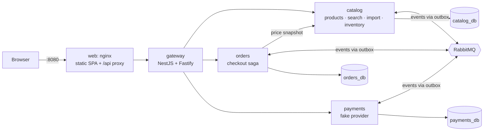
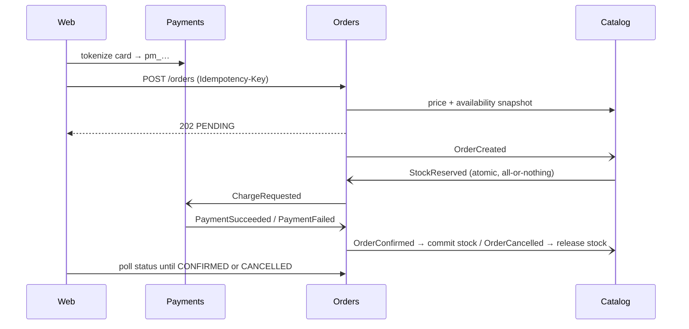

# Stockroom

Repository: **[https://github.com/gcortes83/stockroom](https://github.com/gcortes83/stockroom)**

An e-commerce code challenge built as a small, production-minded system: product CRUD, CSV product import, typo-tolerant search and a purchase flow with a simulated payment provider. The frontend is a modern dark-first SPA with a smart search, a ⌘K command palette and a live checkout tracker.

**New here? Start with the [User & Testing Manual](docs/manual/USER-MANUAL.md)**: screenshots, step-by-step use cases and ready-made test data.

Watch it run: [live test video (2:23)](docs/manual/videos/stockroom-live-test.mp4) · [automated browser suite (1:27)](docs/manual/videos/stockroom-e2e-suite.mp4).

The reasoning behind the build is in [Decisions](#decisions), [`docs/`](docs) and [`docs/adr/`](docs/adr). They cover how the dirty CSV is handled, how overselling is prevented, and how a purchase stays consistent across services.

## Contents

- [Quick start](#quick-start)
- [Prerequisites](#prerequisites)
- [Setup](#setup)
- [Run with Docker (recommended)](#run-with-docker-recommended)
- [Build](#build)
- [Run locally (without Docker for the apps)](#run-locally-without-docker-for-the-apps)
- [URLs to test locally](#urls-to-test-locally)
- [API documentation (OpenAPI)](#api-documentation-openapi)
- [Tracing (OpenTelemetry)](#tracing-opentelemetry)
- [Testing](#testing)
- [Configuration](#configuration)
- [Troubleshooting](#troubleshooting)
- [Example CSV](#example-csv)
- [Features](#features)
- [Architecture](#architecture)
- [Decisions](#decisions)
- [How correctness is protected](#how-correctness-is-protected)
- [Approach](#approach)
- [Project structure](#project-structure)
- [Trade-offs, limitations and future work](#trade-offs-limitations-and-future-work)

## Quick start

```bash
git clone https://github.com/gcortes83/stockroom.git
cd stockroom
docker compose up --build
```

Open **http://localhost:8080**. On first start the catalog is seeded from the example CSV: 87 products are created and 5 invalid rows are rejected. You can inspect the rejected rows under **Imports**.

## Prerequisites

| To… | You need |
|---|---|
| Run everything in Docker | Docker Desktop 4.x (or Docker Engine 24+ with Compose v2) and about 2 GB of free RAM |
| Run the apps locally, build or run tests | Node.js **24+**, pnpm **10** and Docker (for PostgreSQL, RabbitMQ and the integration tests) |

Installing pnpm:

```bash
corepack enable                 # Node 24 ships corepack
npm install -g pnpm@10          # alternative (Node 25+ no longer ships corepack)
pnpm --version                  # 10.x
```

Free ports used by default: `8080` (web), `5432` (PostgreSQL), `5672` and `15672` (RabbitMQ). Local mode also uses `3000`–`3003` and `5173`.

## Setup

```bash
git clone https://github.com/gcortes83/stockroom.git
cd stockroom
```

- **Docker only:** nothing else to do. No `.env` file is needed, because `docker-compose.yml` has safe local defaults.
- **Local development:**

```bash
pnpm install
cp .env.example .env            # optional: only to override ports or tuning values
```

## Run with Docker (recommended)

Start the whole system (PostgreSQL, RabbitMQ, catalog, orders, payments, gateway and web):

```bash
docker compose up --build              # foreground, with logs
docker compose up --build -d --wait    # background; returns when every container is healthy
```

A cold start takes about 30 seconds once the images are built. Each service applies its database migrations on boot, and the catalog seeds the example CSV once.

Useful commands:

```bash
docker compose ps                                   # status and health of every container
docker compose logs -f catalog orders payments      # follow service logs (JSON)
docker compose restart orders                       # restart one service
docker compose down                                 # stop, keep data
docker compose down -v                              # stop and delete all data (re-seeds on next start)
```

Check the running stack with the end-to-end smoke test, which runs inside the stack so no Node is needed on the host:

```bash
docker compose exec -T -e BASE_URL=http://web/api gateway node --input-type=module - < scripts/smoke.mjs
# 19/19 checks passed
```

The same commands are available as `make` shortcuts:

| Command | Does |
|---|---|
| `make up` | `docker compose up -d --build --wait` |
| `make up-tracing` | Same, plus Jaeger and OpenTelemetry tracing enabled |
| `make smoke` | Runs the 19 end-to-end checks inside the stack |
| `make logs` | Follows the service logs |
| `make down` | Stops the stack (including Jaeger) |
| `make e2e` | Runs the Playwright browser tests against http://localhost:8080 |
| `make reset` | Stops the stack and deletes all data |

### RabbitMQ in Docker

RabbitMQ runs as the `rabbitmq` service (`rabbitmq:4.3-management-alpine`, pinned to a minor version) and starts before every service that uses it (`depends_on: service_healthy`).

| File | Purpose |
|---|---|
| `infra/rabbitmq/rabbitmq.conf` | Disables remote `guest` access, loads definitions at boot, sets memory and disk alarms and a consumer timeout |
| `infra/rabbitmq/definitions.json` | Declares the `stockroom` user (password hash only) and the exchanges `stockroom.events` (topic), `stockroom.retry` and `stockroom.dlx` (direct) |

Each service declares its own queues on connect: `catalog.inventory`, `orders.saga` and `payments.commands`, each with `.retry.1s`, `.retry.5s`, `.retry.30s` and `.dlq` companions.

```bash
docker compose exec rabbitmq rabbitmqctl list_queues name messages consumers   # queues and consumers
docker compose exec rabbitmq rabbitmqctl list_exchanges name type              # exchanges
docker compose restart rabbitmq                                                 # services reconnect on their own
```

Services reconnect automatically after a broker restart. Messages caught mid-flight are left unacknowledged, RabbitMQ redelivers them, and idempotent consumers absorb the duplicates. The management UI is at http://localhost:15672 (user `stockroom`, password `stockroom`).

## Build

### Docker images

```bash
docker compose build                    # all images
docker compose build catalog            # a single service
docker compose build --no-cache         # from scratch
```

| Image | Built from | Approx. size |
|---|---|---|
| `stockroom/catalog:local`, `orders`, `payments`, `gateway` | `docker/service.Dockerfile` (`ARG SERVICE`) | ~190 MB each |
| `stockroom/web:local` | `apps/web/Dockerfile` (Vite build served by nginx) | ~51 MB |

Service images are multi-stage builds that run as a non-root user with `tini` as PID 1.

### Source (without Docker)

```bash
pnpm build                                  # every workspace, in dependency order (Turborepo)
pnpm --filter @stockroom/catalog build      # one service and its dependencies
pnpm --filter @stockroom/web build          # static web app in apps/web/dist
pnpm typecheck                              # strict TypeScript across the monorepo
pnpm lint                                   # ESLint, including the "no comments" rule
pnpm check:comments                         # audit: source files contain no comments
```

## Run locally (without Docker for the apps)

Use this for development with hot reload. The infrastructure still runs in Docker; the services and the web app run on your machine.

1. **Start only PostgreSQL and RabbitMQ.** If the full Docker stack is running, stop its app containers first, so they don't consume the same queues:

   ```bash
   docker compose stop web gateway catalog orders payments
   docker compose up -d --wait postgres rabbitmq
   ```

2. **Install and start everything in watch mode:**

   ```bash
   pnpm install
   pnpm dev
   ```

   `pnpm dev` builds the shared packages and then starts each service with `tsc --watch` and `node --watch`. Environment variables come from each service's `dev.env` file. It also starts Vite with hot module reload, and Vite proxies `/api` to the gateway.

3. **Open http://localhost:5173.** Migrations run and the catalog seeds automatically, exactly as in Docker.

To run a single service: `pnpm --filter @stockroom/orders dev`. To add a migration: create `services/<service>/migrations/NNN_description.sql`; it is applied on the next start.

To switch back to the full Docker stack: stop `pnpm dev` (Ctrl+C), then run `docker compose up -d --wait`.

## URLs to test locally

### Web app

| Page | Docker | Local (`pnpm dev`) |
|---|---|---|
| Discover (shop, smart search) | http://localhost:8080/shop | http://localhost:5173/shop |
| Example smart search | http://localhost:8080/shop?q=cheap%20electronics%20under%20%2430%20in%20stock | http://localhost:5173/shop?q=cheap%20electronics%20under%20%2430%20in%20stock |
| Cart | http://localhost:8080/shop/cart | http://localhost:5173/shop/cart |
| Checkout | http://localhost:8080/shop/checkout | http://localhost:5173/shop/checkout |
| Studio · Products | http://localhost:8080/admin/products | http://localhost:5173/admin/products |
| Studio · New product | http://localhost:8080/admin/products/new | http://localhost:5173/admin/products/new |
| Studio · CSV imports | http://localhost:8080/admin/imports | http://localhost:5173/admin/imports |
| Studio · Orders | http://localhost:8080/admin/orders | http://localhost:5173/admin/orders |

Press **⌘K** (or **Ctrl+K**) anywhere to open the command palette.

### REST API

The base URL is **http://localhost:8080/api/v1** in Docker. Locally it is **http://localhost:5173/api/v1** through Vite, or **http://localhost:3000/api/v1** directly on the gateway.

| Method | Path | Purpose |
|---|---|---|
| GET | `/products?q=&category=&minPriceCents=&maxPriceCents=&inStock=&sort=&page=&pageSize=` | List and search products |
| GET | `/products/{id}` | Product detail (returns an `ETag`) |
| POST | `/products` | Create a product |
| PUT | `/products/{id}` | Update a product (requires `If-Match: "<version>"`) |
| DELETE | `/products/{id}` | Soft-delete a product |
| GET | `/categories` | Categories with product counts |
| POST | `/imports` | Upload a CSV (`multipart/form-data`, field `file`) |
| GET | `/imports`, `/imports/{id}`, `/imports/{id}/issues?format=csv` | Import history, report and issue export |
| POST | `/payments/methods` | Tokenize a test card |
| POST | `/orders` | Place an order (requires an `Idempotency-Key` header with a UUID) |
| GET | `/orders`, `/orders/{id}` | Order list and status |

Ready-to-paste examples:

```bash
API=http://localhost:8080/api/v1

curl "$API/products?q=bluetoth&pageSize=3"              # typo-tolerant search
curl "$API/products?category=home-and-office&inStock=true"
curl "$API/categories"

curl -X POST "$API/products" -H 'content-type: application/json' \
  -d '{"sku":"DEMO-1","name":"Demo Lamp","category":"Home & Office","priceCents":1999,"stock":5,"weightGrams":800}'

curl -X POST "$API/imports" -F "file=@Code Challenge E-Commerce.csv"

PM=$(curl -s -X POST "$API/payments/methods" -H 'content-type: application/json' \
  -d '{"cardNumber":"4242424242424242","expMonth":12,"expYear":2030,"cvc":"123","holderName":"Ada"}' \
  | sed -E 's/.*"id":"([^"]+)".*/\1/')
PRODUCT=$(curl -s "$API/products?pageSize=1&inStock=true" | sed -E 's/.*"data":\[\{"id":"([^"]+)".*/\1/')
curl -X POST "$API/orders" -H 'content-type: application/json' -H "idempotency-key: $(uuidgen)" \
  -d "{\"customer\":{\"name\":\"Ada\",\"email\":\"ada@example.com\"},\"lines\":[{\"productId\":\"$PRODUCT\",\"quantity\":1}],\"paymentMethodId\":\"$PM\"}"
```

Errors use `application/problem+json` (RFC 9457) and include a `code` and a `correlationId`.

Interactive docs (Swagger UI) are at **http://localhost:8080/api/docs**; the raw OpenAPI 3.1 document is at http://localhost:8080/api/docs/json. In local mode they are at http://localhost:3000/api/docs.

### Health checks and infrastructure

| What | Docker | Local |
|---|---|---|
| Web (nginx) health | http://localhost:8080/healthz | — |
| Gateway readiness (checks every service) | via `docker compose ps` | http://localhost:3000/health/ready |
| Catalog / orders / payments readiness | via `docker compose ps` | http://localhost:3001/health/ready, http://localhost:3002/health/ready, http://localhost:3003/health/ready |
| API docs (Swagger UI) | http://localhost:8080/api/docs | http://localhost:3000/api/docs |
| RabbitMQ management UI (user `stockroom`, password `stockroom`) | http://localhost:15672 | http://localhost:15672 |
| Jaeger tracing UI (with `make up-tracing`) | http://localhost:16686 | http://localhost:16686 |
| PostgreSQL (user `postgres`, password `postgres`; databases `catalog_db`, `orders_db`, `payments_db`) | `localhost:5432` | `localhost:5432` |

Only the web port and the infrastructure ports are published in Docker. The services are reachable only through the gateway, and internal endpoints such as `/internal/v1/...` are never exposed.

### Test cards

| Card | Outcome |
|---|---|
| 4242 4242 4242 4242 | Approved |
| 4000 0000 0000 0002 | Declined (card declined) |
| 4000 0000 0000 9995 | Declined (insufficient funds) |
| 4000 0000 0000 0119 | Transient processing error, retried automatically, then approved |
| Any other Luhn-valid card | Approved |
| Any card, total above $10,000 | Declined (limit exceeded) |

Use any future expiry date (for example `12/30`) and any CVC (for example `123`). The checkout page has buttons that fill these in.

### Suggested walkthrough

1. **Search:** open Discover and type `cheap electronics under $30 in stock`. It turns into removable filters.
2. **Buy:** open a product, add it to the cart, check out with `4242…`, and watch the order tracker reach **Confirmed**.
3. **Decline:** repeat with `4000 0000 0000 0002`. The order is cancelled and the reserved stock is released.
4. **Import:** open Studio → Imports → the seeded import. Review the 5 rejected rows and download the issue CSV.
5. **Conflict:** edit the same product in two tabs and save both. The second save shows a conflict dialog.

## API documentation (OpenAPI)

- The OpenAPI 3.1 document is generated from the same zod schemas the services and the UI use (`packages/contracts/src/openapi.ts`), so the docs cannot drift from the validation rules.
- The gateway serves it with Swagger UI at `/api/docs`. "Try it out" works against the running stack.
- A contract test checks that every public route is documented. A Playwright test checks that the page renders through nginx's Content-Security-Policy.

## Tracing (OpenTelemetry)

Tracing is off by default. To enable it with Jaeger:

```bash
make up-tracing
# or: OTEL_ENABLED=true docker compose --profile observability up -d --build --wait
```

Place an order in the UI, then open **http://localhost:16686** and search for service `gateway`. A purchase appears as **one trace across gateway, orders, catalog and payments**. It contains the HTTP spans, the PostgreSQL queries, and a `publish`/`process` span pair for every event (`orders.order.created.v1`, `catalog.stock.reserved.v1`, `payments.charge.requested.v1`, …).

How it works:
- The OpenTelemetry SDK starts before anything else (`import '@stockroom/platform/tracing'`), with the HTTP, undici (fetch) and pg instrumentations.
- The trace context of the request is stored in the outbox row together with the event.
- The relay publishes inside that context, and the W3C `traceparent` travels in the AMQP headers.
- Consumers continue the trace. So the outbox does not break the trace.

In local mode, start Jaeger with `docker compose --profile observability up -d jaeger` and set `OTEL_ENABLED=true` in the services' `dev.env` files.

## Testing

```bash
pnpm test                 # unit tests + gateway HTTP tests (109 tests)
pnpm test:integration     # integration + Supertest HTTP suites against real PostgreSQL via Testcontainers (61 tests, Docker required)
pnpm test:coverage        # all suites with coverage; fails below 80% lines on domain/application code (Docker required)
pnpm bench:search         # 10k-product search benchmark; see docs/benchmarks/search.md
pnpm test:e2e             # Playwright browser tests + axe accessibility checks against http://localhost:8080 (32 tests)
make smoke                # 19 end-to-end API checks against the running Docker stack
BASE_URL=http://localhost:5173/api node scripts/smoke.mjs   # same checks against local dev mode
```

First-time setup for the browser tests: `pnpm --filter @stockroom/web exec playwright install chromium`. Use `E2E_BASE_URL=http://localhost:5173` to run them against local mode. Reports are written to `apps/web/playwright-report`.

| Suite | Count | Highlights |
|---|---|---|
| Contracts | 39 | Money parsing (property-based), schemas, a valid example for every event type, OpenAPI coverage |
| Platform | 12 | Config fail-fast, validation pipe, request ids, message delivery (retry, dead-letter, closed channel), trace propagation through messages |
| Catalog unit / integration / HTTP | 17 / 21 / 12 | Every CSV rule, the example-file oracle, re-import idempotency, search relevance, 20-way concurrent purchase, reservation expiry, duplicate messages; full HTTP lifecycle with ETag/If-Match, multipart import, problem+json |
| Orders unit / integration / HTTP | 11 / 8 / 7 | Every state × event cell; idempotency under concurrency, price change, decline, late-payment refund; HTTP idempotency headers and 409/422/428 problems |
| Payments unit / integration / HTTP | 9 / 9 / 4 | Luhn, brands, test cards, limits; charge, decline, transient retry, duplicate delivery, refunds; tokenization never echoes or stores the card number or CVC |
| Gateway unit / HTTP | 3 / 7 | Routing, Location rewrite, 502 problem when an upstream is down, internal routes hidden, rate limiting, OpenAPI and Swagger UI |
| Web | 11 | Smart-search parser, cart math and caps |
| Playwright (browser) | 32 | Smart search, typo search, XSS rendering, ⌘K palette, approved/declined/sold-out/price-changed purchases, Studio CRUD, two-tab edit conflict, CSV import report and download, Swagger UI, axe WCAG 2.1 AA on 7 pages × 2 themes, mobile viewport |
| Smoke (end-to-end API) | 19 | CRUD, conflicts, decline, approve, retry, idempotency, sold out, internal routes hidden |

### Coverage

`pnpm test:coverage` runs every suite (unit, integration, HTTP) with V8 coverage. Domain and application code must reach **80% lines**, otherwise the run fails.

| Workspace | Lines covered (domain + application) |
|---|---|
| catalog | 90.5% |
| orders | 93.2% |
| payments | 100% |
| contracts | 99.0% (whole package) |

`platform` and `gateway` are reported without a threshold (infrastructure code is covered by the service integration suites and the smoke test).

### Search benchmark

`pnpm bench:search` generates 10,000 products, imports them through `POST /api/v1/imports`, and runs a 10 s warm-up plus 3 × 30 s with 50 connections over six query shapes. It also captures `EXPLAIN (ANALYZE, BUFFERS)` for each shape. Start the stack with a raised gateway limit first, so the load test measures latency rather than rate limiting:

```bash
RATE_LIMIT_PER_MINUTE=100000000 docker compose up -d --wait
pnpm bench:search            # add --skip-import on later runs
docker compose up -d --wait  # restore the default limit afterwards
```

Latest result ([full report](docs/benchmarks/search.md)): **median p95 111 ms** (target < 300 ms), about 1,000 req/s, 0 errors, all text-search shapes served by indexes. Before multi-word typo tolerance it was 44 ms, but the two-typo query then returned no results at all; rounds vary by about ±70 ms on a laptop. Load is generated from a container on the compose network, still going through nginx → gateway → catalog.

### Git hooks

`pnpm install` runs `lefthook install`. Before each commit, ESLint and the no-comments audit run on the staged files; commit messages must follow Conventional Commits (`feat(catalog): …`, `fix: …`).

## Configuration

Defaults work out of the box. To override them, copy `.env.example` to `.env`; Docker Compose reads it automatically.

| Variable | Default | Effect |
|---|---|---|
| `WEB_PORT` | `8080` | Host port of the web app |
| `POSTGRES_PORT` | `5432` | Host port of PostgreSQL |
| `RABBITMQ_PORT` / `RABBITMQ_UI_PORT` | `5672` / `15672` | Host ports of RabbitMQ |
| `LOG_LEVEL` | `info` | Service log level |
| `RESERVATION_TTL_SECONDS` | `600` | How long stock stays reserved while payment is pending |
| `PAYMENT_SIMULATED_LATENCY_MS` | `800` | Artificial payment delay, so the tracker is visible |
| `SEED_ON_START` | `true` | Import the example CSV when the catalog is empty |
| `RATE_LIMIT_PER_MINUTE` | `300` | Gateway default rate limit per client (raise only for benchmarks) |

Every service validates its configuration at startup and exits with a readable message if a value is invalid.

## Troubleshooting

| Symptom | Fix |
|---|---|
| `port is already allocated` | Change the port in `.env` (for example `WEB_PORT=8081`) or stop the other process |
| Web shows "Could not reach the server" | `docker compose ps`: wait until every service is `healthy`, or check `docker compose logs gateway` |
| Local mode cannot connect to RabbitMQ or Postgres | `docker compose up -d --wait postgres rabbitmq`, and check that ports 5432 and 5672 are free |
| Local services and Docker services both running | Stop one set: `docker compose stop web gateway catalog orders payments` |
| Want a clean catalog | `docker compose down -v && docker compose up -d --wait` |
| `pnpm: command not found` | `corepack enable` (Node 24) or `npm install -g pnpm@10` |
| Integration tests fail to start | Docker must be running; Testcontainers pulls `postgres:17-alpine` the first time |

## Example CSV

- Source: the `Code Challenge E-Commerce.csv` file provided with the challenge. It is stored at the repository root and copied to `services/catalog/seed/example.csv` for seeding.
- **Downloaded on 2026-10-05.**
- The file is intentionally dirty. Every problem and how it is handled is listed in [`docs/csv-data-profile.md`](docs/csv-data-profile.md):

| Problem in the file | Handling |
|---|---|
| `$29.99` | Currency symbol stripped, accepted |
| `free` price, stock `-5`, empty or whitespace-only name, empty category | Row rejected with a line-numbered error |
| Duplicate SKUs (RS-001 ×2, BS-021 ×3) | Last occurrence wins, warning recorded |
| `<script>…` and `Robert'); DROP TABLE…` names | Stored literally; harmless thanks to parameterized SQL and React text rendering |
| Empty weight | Accepted as "no weight" |
| Blank `,,,,,,` rows, quoted commas, escaped quotes, CRLF, UTF-8 `—™` | Handled by the RFC 4180 parser |

The result, asserted by an integration test: **97 lines, 2 blank, 95 processed, 87 created, 5 rejected, 3 warnings**. Re-importing the same file yields 87 unchanged.

## Features

- **Discover (shop)**
  - Smart search: phrases like `cheap electronics under $30 in stock` become visible, removable filters. It is a deterministic parser that runs offline, not an LLM.
  - Typo-tolerant full-text search, even with several misspelled words (`runing shoez`). When no product matches every word, the closest matches are shown with a hint. Category chips, price range, stock filter and sorting. All state is kept in the URL, so it can be shared.
  - Product pages with generative artwork per SKU.
  - A cart saved on the device.
  - Checkout with test cards, and a live order tracker that animates each checkout step.
- **Studio (admin)**
  - Product table with search and a category filter.
  - Create/edit form with a live preview; delete with confirmation.
  - Concurrent edits are detected (`ETag`/`If-Match`), with a "reload latest and keep my edits" dialog.
  - CSV import: drag and drop, upload progress, a data-quality report, a filterable issue table and a downloadable issue CSV.
  - Orders view showing where each order is in the checkout saga.
- **Command palette** (⌘K / Ctrl+K) and a light/dark theme toggle.

## Architecture



Checkout saga, orchestrated by `orders`:



Full detail is in [`docs/technical-specification.md`](docs/technical-specification.md).

## Decisions

| Decision | Choice | Main alternatives | Why | ADR |
|---|---|---|---|---|
| Architecture | Microservices in a pnpm monorepo | Modular monolith | Shows service boundaries, consistency and failure handling; each service is kept small | [0001](docs/adr/0001-microservices-architecture.md) |
| Data | PostgreSQL 17, node-postgres, SQL migrations, database per service | Prisma, MongoDB | The critical queries are SQL anyway; no code generation or native engines | [0002](docs/adr/0002-postgresql-node-postgres.md) |
| Messaging | RabbitMQ + transactional outbox + idempotent consumers | Kafka, Redis Streams | No lost events, no duplicate effects, retry and dead-letter queues built in | [0003](docs/adr/0003-rabbitmq-outbox-idempotent-consumers.md) |
| Consistency | Orchestrated saga, reservations with a TTL | Choreography, 2PC | One place to reason about the flow; compensations and refunds are explicit | [0004](docs/adr/0004-orchestrated-checkout-saga.md) |
| Money | Integer cents, parsed from strings | Floats, NUMERIC | Exact arithmetic | [0005](docs/adr/0005-money-and-weight-as-integers.md) |
| Search | Postgres full-text + trigram | Meilisearch, OpenSearch | Always consistent with writes; no extra infrastructure at this size | [0006](docs/adr/0006-postgres-full-text-search.md) |
| CSV import | Row-level validation, last wins, upsert by SKU | All-or-nothing, reject existing SKUs | Bad rows never block good ones; re-import is idempotent | [0007](docs/adr/0007-csv-import-rules.md) |
| Frontend | React SPA + TanStack Query + Tailwind/Radix | Next.js, MUI | Static deployment, shared schemas, modern look | [0008](docs/adr/0008-frontend-stack.md) |
| Auth | None, with a banner in the Studio | Basic auth, OIDC | Not required by the challenge; an explicit accepted risk | [0009](docs/adr/0009-no-authentication.md) |
| Shared code | Only `contracts` and `platform` | Copy per service | One implementation of the reliability code | [0010](docs/adr/0010-shared-platform-package.md) |
| Payments | Card tokenization | Card data in orders | No card numbers in orders, events or logs | [0011](docs/adr/0011-payment-tokenization.md) |

## How correctness is protected

- **No overselling.** Stock is reserved with `UPDATE … SET reserved = reserved + n WHERE stock - reserved >= n`, rows are locked in id order, and `CHECK (reserved <= stock)` guards the database. An integration test fires 20 concurrent orders for the last unit; exactly one wins.
- **No duplicate orders or charges.**
  - `Idempotency-Key` plus a hash of the request body: the same request is replayed; a different body gets 422.
  - `payments.order_id` is unique.
  - Every consumer de-duplicates messages through `processed_messages`.
- **No lost events.** A transactional outbox, plus retry queues and dead-letter queues.
- **No lost updates in the Studio.** Each product has a `version` checked through `ETag`/`If-Match`: 428 if the header is missing, 409 if the version is stale.
- **Exact money.** Integer cents from parsing to storage. Property-based tests check that amounts round-trip exactly.
- **Hostile input.**
  - Parameterized SQL, and React renders product text as text.
  - nginx sends a Content-Security-Policy.
  - Exported CSVs escape spreadsheet formulas.
  - Uploads and requests are size- and rate-limited.

## Approach

1. **Requirements first.** The open questions (stack, architecture style, data layer) were asked and answered before building. The example CSV was profiled before any import code was written, and its expected counts became the integration-test oracle.
2. **Spec-driven.** Use cases ([`docs/use-cases.md`](docs/use-cases.md)) led to a technical specification with non-functional requirements and their mitigations, then to an implementation plan with task dependencies ([`docs/implementation-plan.md`](docs/implementation-plan.md)). The work is also recorded in OpenSpec: 8 archived changes (`openspec/changes/archive/`) built the 12 capability specs in `openspec/specs/` (54 requirements with scenarios). The remaining work is an active change, `quality-gates-and-search-benchmark`, ready for `/opsx:apply`.
3. **AI-assisted, human-guided.** Claude Code generated most of the code under project skills (`.claude/skills/`) that encode the conventions. Decisions and corrections were made deliberately:
   - Prisma was replaced when its pnpm and Alpine friction appeared.
   - The data profile was corrected when the tests disagreed with it (17 categories, not 18).

   As the challenge requires, **source files contain no comments**. This is enforced by a custom ESLint rule and by `scripts/check-no-comments.sh`.
4. **Verified, not assumed.** Unit tests, integration tests with Testcontainers, end-to-end smoke tests, a no-cache build from a clean checkout, and a manual pass through the UI in the browser.

### Assumptions

- Prices are in USD only.
- The cart holds multiple items and is saved on the device.
- Re-importing an existing SKU updates the product.
- Categories are created from the data.
- SKUs cannot be changed after creation.
- Out-of-stock products are shown but cannot be bought.
- Orders with a zero total skip payment.
- Stock reservations expire after 10 minutes.
- There is no authentication.

## Project structure

```
apps/web                React SPA (Vite, TanStack Query, Tailwind, Radix, cmdk, motion) + nginx config
services/gateway        Routing, rate limits, security headers, problem+json for upstream errors
services/catalog        Products, categories, search, CSV import, stock reservations, seeding
services/orders         Orders, idempotency, saga state machine
services/payments       Card tokenization, simulated charges and refunds
packages/contracts      Zod schemas shared by the UI, services and events; money and SKU rules
packages/platform       Config, logging, errors, migrations, outbox, broker, idempotent consumers, health
docker/                 Shared service Dockerfile
infra/postgres          Database and role bootstrap
scripts/                Smoke test and comment audit
docs/                   Use cases, CSV profile, technical spec, implementation plan, ADRs
docs/manual/            User & testing manual, screenshots and sample CSV files
openspec/               Capability specs (specs/), archived changes and the active change
```

## Trade-offs, limitations and future work

- **Recently added:**
  - OpenAPI docs with Swagger UI
  - Supertest HTTP suites for every service
  - Playwright browser tests with axe accessibility checks; they found and fixed colour-contrast issues in both themes
  - OpenTelemetry tracing across services and through RabbitMQ
- **Quality gates:** coverage thresholds, git hooks and the 10k-product search benchmark (p95 44 ms). The benchmark found and fixed two real issues: missing SSD planner settings in Postgres, and nginx exhausting ports while caching a stale gateway IP.
- Microservices are more machinery than this scope strictly needs. That was a deliberate choice (ADR 0001); a modular monolith would be the pragmatic production choice for a small team.
- One PostgreSQL instance hosts the three databases locally; production would use separate clusters.
- Pagination uses offsets; keyset pagination is the next step for large catalogs.
- There is no authentication. The gateway is where an OIDC admin guard would go.
- Payments are simulated. A real provider would sit behind the same tokenization and charge interfaces.
