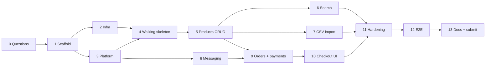

# Stockroom — Implementation Plan

Complete task list for building Stockroom end to end, tests included.
Inputs: `requeriments.txt`, `docs/use-cases.md`, `docs/csv-data-profile.md`, `CLAUDE.md`, `.claude/skills/*`.

## How to use this plan

- Each **phase** becomes one OpenSpec change (`/opsx:propose <change-name>`). The change's `tasks.md` refines the tasks below; this file is the master roadmap.
- Phases are **vertical slices**: backend, UI and tests ship together, so the app runs end to end after every phase.
- Size: **S** ≤ 1 h · **M** 1–2 h · **L** 2–4 h (split L before applying).
- Every task inherits the definition of done from `CLAUDE.md`: lint, typecheck and tests green, no code comments, Docker build still works, docs updated when behavior changes.
- ⚠️ marks tasks that depend on an open question in `docs/use-cases.md`.

## Implementation status (2026-10-05)

The backend and frontend are implemented and verified: `docker compose up --build` starts the whole stack, seeds the example CSV and passes the 19-check end-to-end smoke test (`scripts/smoke.mjs`). 109 unit tests, 52 integration/HTTP tests (Testcontainers + Supertest), 30 Playwright browser tests and the 19-check smoke test pass. Checked boxes below are done; unchecked ones are open.

### Deviations from the original plan

| Item | Plan said | Built | Why |
|---|---|---|---|
| Data layer (T2.4, T5.2, T9.7, T9.12) | Prisma schema and `prisma migrate` | `pg` + plain SQL migrations run at boot (`runMigrations`) | Prisma clients collide in the pnpm store and need native engines on Alpine; critical SQL is raw anyway (ADR 0002, TD-05) |
| Dockerfiles (T2.4) | One Dockerfile per service | One parameterized `docker/service.Dockerfile` (`ARG SERVICE`) + `apps/web/Dockerfile` | Identical build steps; less duplication |
| Rate limiting (T4.2) | `@nestjs/throttler` | `@fastify/rate-limit` with per-route buckets | Proxied routes are Fastify plugin routes, which Nest guards never see |
| Health (T3.5) | `@nestjs/terminus` | Small controller in `InfraModule` (DB, broker, outbox backlog) | Fewer dependencies, same contract |
| Location headers | Services aware of `/api` prefix | Services return their own paths; `@fastify/http-proxy` rewrites them | The proxy already rewrites `Location`; the first version produced `/api/api/...` (caught by the smoke test) |
| Import fixtures (T7.1) | One file per dirty case | Inline CSV strings in tests + the real example file | Smaller, the example file already covers every case |
| Saga suite (T9.15) | Three services in Testcontainers | Orders integration tests drive the saga with real Postgres and simulated events; full cross-service flow verified by the compose smoke test | Same coverage at a fraction of the setup cost |
| Smart search (new) | — | Deterministic natural-language parser (`shared/lib/smart-query.ts`) + ⌘K palette | "AI look and feel" without network calls or keys |

### Completed after the first release

| Task | Delivered |
|---|---|
| T3.4 | OpenAPI 3.1 generated from the zod contracts; Swagger UI at `/api/docs` |
| T5.6, T7.7, T9.11 | Supertest HTTP suites for catalog (12), orders (7), payments (4) and gateway (7) |
| T11.3 | OpenTelemetry tracing (HTTP, fetch, pg + manual producer/consumer spans); trace context stored in the outbox, so one order is one trace across four services; Jaeger profile in compose |
| T11.5 | axe WCAG 2.1 AA checks on 7 pages in both themes; fixed contrast of `--subtle` (both themes) and of the light status colours; `MotionConfig reducedMotion="user"` |
| T12.1–T12.7 | Playwright suite (30 tests) including a mobile viewport and a two-tab conflict |
| T1.7 | lefthook pre-commit (ESLint + no-comments on staged files) and commitlint on commit messages |
| T3.8 | V8 coverage with an 80% line threshold on domain/application code: catalog 90.5%, orders 93.2%, payments 100% (new payments integration suite) |
| T6.5 | `pnpm bench:search`: 10,087 products, p95 44 ms, about 1,700 req/s, 0 errors (`docs/benchmarks/search.md`). Fixed SSD planner costs (catalog migration 003) and nginx upstream keep-alive with DNS re-resolution |

### Remaining work

| Task | Status |
|---|---|
| T0.4 | Use cases still carry ⚠️; current defaults are listed in README "Assumptions" |
| T5.11, T6.7, T7.10, T10.6 | Pure-logic web tests plus 29 Playwright tests cover these flows; isolated Testing Library + MSW component tests not added |
| T8.6 | Round trip verified in compose (smoke); dedicated RabbitMQ Testcontainers test pending |
| T9.15 | See deviations; three-service Testcontainers suite pending |
| T11.1 | Limits, CSP, CORS, helmet done; `pnpm audit` review pending |
| T11.2 | Graceful shutdown implemented (drain consumers, stop relay, close pool); verification under load pending |
| T13.5 | Cold start from empty volumes verified (29 s); fresh-clone check pending until the repository exists |
| T13.6 | Repository: https://github.com/gcortes83/stockroom. Push of the commit history pending |

## Traceability legend

- **Depends on**: tasks that must be done (verified) before this task starts. Cross-phase dependencies are explicit; the phase-level roadmap is the summary of these.
- **Unblocks**: tasks that list this one as a dependency (the reverse of Depends on; when editing a dependency, update both columns).
- **Produces**: the artifact the task delivers; later tasks consume it.
- **Traces to**: use cases in `docs/use-cases.md` and requirement ids below.
- Dependency graph validated: every id exists, no cycles, no dependency on a later phase. Inside a phase, follow the dependency order rather than the numbering (e.g. T3.7 before T3.3).

| Req | Requirement (`requeriments.txt`) |
|---|---|
| R1 | Local database (SQL/NoSQL) |
| R2 | CRUD for products |
| R3 | Import products from CSV |
| R4 | Search for products |
| R5 | Purchase products with a fake payment |
| R6 | UI for CRUD, search and purchase |
| R7 | Runnable as a Docker container |
| R8 | README with decisions, approach and alternatives considered |
| R9 | No code comments when AI is used |
| R10 | Solution in a GitHub repository |
| R11 | Instructions to run locally |
| R12 | Use the example CSV; README states its download date |
| R13 | Enterprise-grade quality (implied: correctness, testing, operability, security) |

**Longest dependency chain (31 tasks):** T0.1 → T0.3 → T1.1 → T1.2 → T1.3 → T1.4 → T1.5 → T1.7 → T1.8 → T3.1 → T3.2 → T3.3 → T3.8 → T4.1 → T5.2 → T5.3 → T5.4 → T9.6 → T9.9 → T9.11 → T9.16 → T10.3 → T10.4 → T10.6 → T10.7 → T12.1 → T12.2 → T12.7 → T13.2 → T13.5 → T13.6

## Roadmap

| Phase | OpenSpec change | Use cases | Depends on |
|---|---|---|---|
| 0 | `resolve-open-questions` (explore only) | all | — |
| 1 | `scaffold-monorepo` | — | 0 |
| 2 | `local-infrastructure` | — | 1 |
| 3 | `platform-foundations` | — | 1 |
| 4 | `walking-skeleton` | UC-01 (stub) | 2, 3 |
| 5 | `catalog-products-crud` | UC-01, 03, 04, 05, 06 | 4 |
| 6 | `product-search` | UC-02 | 5 |
| 7 | `csv-product-import` | UC-07, 08, 15 | 5 |
| 8 | `messaging-backbone` | — | 3 |
| 9 | `orders-and-payments` | UC-10, 11, 13, 14 | 5, 8 |
| 10 | `shop-cart-and-checkout` | UC-09, 10, 12 | 9 |
| 11 | `hardening` | all | 5–10 |
| 12 | `end-to-end-tests` | all | 10 |
| 13 | `documentation-and-submission` | — | all |

Critical path: 0 → 1 → 2/3 → 4 → 5 → 8 → 9 → 10 → 12 → 13. Phases 6 and 7 can run in parallel with 8.

---

## Phase 0 — Resolve open questions and record decisions

- [x] **T0.1** (M) Run `/opsx:explore` over the open questions in `docs/use-cases.md` and `docs/csv-data-profile.md`. Record each answer.
- [x] **T0.2** (S) Confirm the CSV download date (2026-10-05) for the README.
- [x] **T0.3** (M) Write ADRs:
  - 0002 PostgreSQL + Prisma, database-per-service
  - 0003 RabbitMQ with transactional outbox and idempotent consumers
  - 0004 Orchestrated checkout saga, with stock reservations kept in catalog
  - 0005 Money as integer cents, weight as grams
  - 0006 PostgreSQL full-text + trigram search instead of a dedicated search engine
  - 0007 CSV import rules (normalization, duplicates, upsert)
  - 0008 Frontend stack
  - 0009 No authentication (admin vs shopper by route) ⚠️
  - 0010 Shared technical package `packages/platform`: cross-cutting code only, no domain
  - 0011 Payment method tokenization in payments; no card data in orders or events
- [ ] **T0.4** (S) Update `docs/use-cases.md`: replace ⚠️ items with the decisions.

### Task dependencies — Phase 0

| Task | Depends on | Unblocks | Produces | Traces to |
|---|---|---|---|---|
| T0.1 | — | T0.3, T0.4, T7.1 | Decision log for all open questions | UC-all, R13 |
| T0.2 | — | T13.2 | Confirmed CSV download date | R12 |
| T0.3 | T0.1 | T1.1, T5.1, T8.1, T13.3 | ADRs 0002–0011 | R8 |
| T0.4 | T0.1 | — | Use cases without ⚠️ items | UC-all |

## Phase 1 — Scaffold the monorepo

- [x] **T1.1** (S) Root setup:
  - `package.json` with `packageManager` pnpm, `pnpm-workspace.yaml`, `turbo.json`
  - Node 24 engines, `.npmrc`
- [x] **T1.2** (S) `packages/tsconfig`: strict base, `node` and `react` presets.
- [x] **T1.3** (M) `packages/eslint-config`:
  - typescript-eslint strict, import order, no-console
  - Rules: **no comments** (`no-warning-comments` plus a custom `no-restricted-syntax` / eslint-plugin rule for any comment), no explicit any
  - Prettier
- [x] **T1.4** (S) Workspace skeletons (empty, build green) for:
  - `packages/contracts`
  - `packages/platform`
  - `services/{gateway,catalog,orders,payments}`
  - `apps/web`
- [x] **T1.5** (S) Root scripts: `dev`, `build`, `lint`, `typecheck`, `test`, `test:e2e`, `format`.
- [x] **T1.6** (S) Vitest workspace config (unplugin-swc for NestJS decorators). Add one sample passing test per workspace.
- [x] **T1.7** (S) Git hooks:
  - lefthook or husky running lint-staged and a no-comments check
  - commitlint with Conventional Commits
- [x] **T1.8** (S) **Verify:** `pnpm i && pnpm build && pnpm lint && pnpm test` passes.

### Task dependencies — Phase 1

| Task | Depends on | Unblocks | Produces | Traces to |
|---|---|---|---|---|
| T1.1 | T0.3 | T1.2, T1.3 | Root workspace (pnpm, turbo) | R7, R11 |
| T1.2 | T1.1 | T1.3, T1.4 | Shared tsconfig presets | R13 |
| T1.3 | T1.1, T1.2 | T1.4, T1.7 | ESLint config with no-comments rule | R9 |
| T1.4 | T1.2, T1.3 | T1.5, T1.6 | Empty buildable workspaces | R13 |
| T1.5 | T1.4 | T1.7, T1.8 | Root scripts | R11 |
| T1.6 | T1.4 | T1.8, T3.6 | Vitest workspace | R13 |
| T1.7 | T1.3, T1.5 | T1.8 | Pre-commit and commit-msg hooks | R9, R10 |
| T1.8 | T1.5, T1.6, T1.7 | T2.1, T2.4, T3.1, T3.4, T3.7, T4.3 | Green build/lint/test baseline | R13 |

## Phase 2 — Local infrastructure

- [x] **T2.1** (M) `docker-compose.yml` with postgres 17 and rabbitmq 4-management:
  - Healthchecks, named volumes
  - Only needed ports published
- [x] **T2.2** (S) `infra/postgres/init.sql` creating `catalog_db`, `orders_db`, `payments_db` and one user per database, with least privilege.
- [x] **T2.3** (S) `.env.example` with local defaults. Compose must work without a `.env` file.
- [x] **T2.4** (M) Multi-stage Dockerfile template for NestJS services:
  - pnpm fetch/deploy, non-root user, tini
  - Entrypoint runs `prisma migrate deploy` before start
- [x] **T2.5** (S) `.dockerignore` and an optional `Makefile` (`up`, `down`, `reset`, `logs`, `test`).
- [x] **T2.6** (S) **Verify:** `docker compose up postgres rabbitmq` reports both healthy, and each service user can reach only its own database.

### Task dependencies — Phase 2

| Task | Depends on | Unblocks | Produces | Traces to |
|---|---|---|---|---|
| T2.1 | T1.8 | T2.2, T2.3, T2.5 | Compose with Postgres and RabbitMQ | R1, R7 |
| T2.2 | T2.1 | T2.6, T9.7, T9.12 | Per-service databases and users | R1 |
| T2.3 | T2.1 | T2.6 | .env.example with defaults | R11 |
| T2.4 | T1.8 | T2.5, T4.1, T4.2, T9.7, T9.12 | NestJS Dockerfile template | R7 |
| T2.5 | T2.1, T2.4 | T4.5 | .dockerignore, Makefile | R7, R11 |
| T2.6 | T2.2, T2.3 | T4.1, T8.2 | Verified local infrastructure | R1, R7 |

## Phase 3 — Platform foundations (`packages/platform`, `packages/contracts`)

- [x] **T3.1** (M) Config module: zod env schema, fails fast on invalid config.
  - **Test:** invalid env throws with a readable message.
- [x] **T3.2** (M) Logging:
  - nestjs-pino with redaction
  - Correlation-id middleware: read or generate `x-request-id`, store in AsyncLocalStorage, add to logs
  - **Test:** id propagates into log context.
- [x] **T3.3** (M) Problem-details exception filter (RFC 9457) and a domain-error-to-HTTP mapping registry.
  - **Tests:** validation error → 400 with `errors[]`; unknown error → 500 with no stack trace leaked.
- [x] **T3.4** (S) `ZodValidationPipe` (nestjs-zod) and OpenAPI generation from zod.
- [x] **T3.5** (S) Health module: `/health/live` and `/health/ready` (Prisma ping; broker ping added later).
- [x] **T3.6** (S) Utilities with unit tests:
  - UUID v7 generator
  - Injectable clock
  - `Money` value object (string to cents parsing, no floats)
  - Property-based tests for Money with fast-check: `"19.99"` → 1999, `"0.1"`, `"1,299.00"`, rejects `"free"`, rejects 3 decimals.
- [x] **T3.7** (S) Contracts: pagination schemas, problem-details schema, `Money` schema.
- [x] **T3.8** (S) **Verify:** platform package has 100% unit coverage on Money and the problem filter.

### Task dependencies — Phase 3

| Task | Depends on | Unblocks | Produces | Traces to |
|---|---|---|---|---|
| T3.1 | T1.8 | T3.2, T3.5, T3.8 | Config module | R13 |
| T3.2 | T3.1 | T3.3, T3.8, T8.5 | Logger and correlation id | R13 |
| T3.3 | T3.2, T3.7 | T3.8, T5.6, T7.7, T9.11 | Problem-details filter | R13 |
| T3.4 | T1.8 | T3.8, T5.6 | Zod pipe and OpenAPI | R13 |
| T3.5 | T3.1 | T3.8, T8.2 | Health module | R7 |
| T3.6 | T1.6 | T3.8, T5.1, T7.2 | UUID v7, clock, Money | R2, R5 |
| T3.7 | T1.8 | T3.3, T3.8, T4.3, T5.5, T8.1 | Base contract schemas | R13 |
| T3.8 | T3.1, T3.2, T3.3, T3.4, T3.5, T3.6, T3.7 | T4.1, T4.2, T8.3, T9.7, T9.12 | Verified platform package | R13 |

## Phase 4 — Walking skeleton (UC-01 stub)

- [x] **T4.1** (M) Catalog service bootstrap:
  - Nest app, config, logger, health, problem filter
  - Prisma schema with an empty `products` table and first migration
  - Dockerfile
- [x] **T4.2** (M) Gateway bootstrap:
  - Proxies `/api/v1/products*` to catalog
  - helmet, CORS, throttler, body limits, request-id
  - Aggregated `/api/docs`
- [x] **T4.3** (M) Web bootstrap:
  - Vite, React 19, Router with `/shop` and `/admin` layouts
  - TanStack Query provider, Tailwind + shadcn, API client parsing problem+json
  - Product list page calling the gateway
- [x] **T4.4** (S) Web Dockerfile: nginx serves the build and proxies `/api` to the gateway, published on port 8080.
- [x] **T4.5** (S) Add catalog, gateway and web to compose with `depends_on: service_healthy`.
- [x] **T4.6** (S) Smoke test script `scripts/smoke.sh`: curl health endpoints and `GET /api/v1/products`.
- [x] **T4.7** (S) **Verify:** a fresh `docker compose up --build` shows an empty product list at http://localhost:8080.

### Task dependencies — Phase 4

| Task | Depends on | Unblocks | Produces | Traces to |
|---|---|---|---|---|
| T4.1 | T2.4, T2.6, T3.8 | T4.5, T5.2, T7.1 | Catalog service skeleton | UC-01, R1 |
| T4.2 | T2.4, T3.8 | T4.5, T9.16 | Gateway skeleton | R7 |
| T4.3 | T1.8, T3.7 | T4.4, T5.10 | Web app shell | R6 |
| T4.4 | T4.3 | T4.5, T11.1 | Web image (nginx) | R6, R7 |
| T4.5 | T2.5, T4.1, T4.2, T4.4 | T4.6, T5.12, T7.8 | Full stack in compose | R7 |
| T4.6 | T4.5 | T4.7 | Smoke script | R11 |
| T4.7 | T4.6 | T5.7 | Verified walking skeleton | UC-01, R7 |

## Phase 5 — Products CRUD (UC-01, 03, 04, 05, 06)

Backend (catalog):
- [x] **T5.1** (M) Domain:
  - `Product` aggregate, `Sku`, `Money`, `Weight` value objects
  - Domain errors: `ProductNotFound`, `DuplicateSku`, `VersionConflict`
  - **Unit tests** for invariants (trimmed non-empty name, price ≥ 0, integer stock ≥ 0, SKU normalization).
- [x] **T5.2** (M) Prisma schema and migration:
  - Tables: `products` (sku unique, version, deleted_at, CHECK constraints), `categories` ⚠️
  - Indexes per the database-postgres skill
- [x] **T5.3** (M) Repository adapter and `UnitOfWork`.
  - **Integration tests** with Testcontainers: create, find, unique violation → `DuplicateSku`, optimistic lock, soft-delete filtering.
- [x] **T5.4** (M) Use cases: create, get, list (paginated, sorted), update (`If-Match`), delete (soft; reject with active reservations), list categories.
  - **Unit tests** with in-memory fakes.
- [x] **T5.5** (S) Contracts: product create/update/response schemas and list query schema.
- [x] **T5.6** (M) Controllers and mapping: ETag/If-Match, `Location` header, status codes.
  - **HTTP tests** (Supertest): 201/200/204/400/404/409/412 paths.

Frontend (admin):
- [x] **T5.7** (M) Admin products table: pagination, sort, out-of-stock badge, loading/empty/error states.
- [x] **T5.8** (M) Create/edit form:
  - react-hook-form with the shared zod schema
  - Server field errors mapped onto inputs
  - 409 handling: duplicate SKU, or stale version with a reload prompt
- [x] **T5.9** (S) Delete confirmation dialog with toast feedback.
- [x] **T5.10** (S) Shop catalog page and product detail page (read-only).
- [ ] **T5.11** (M) **Component tests** (Testing Library + MSW): form validation, conflict flow, delete flow, empty state.
- [x] **T5.12** (S) **Verify:** full CRUD works in the UI through docker compose.

### Task dependencies — Phase 5

| Task | Depends on | Unblocks | Produces | Traces to |
|---|---|---|---|---|
| T5.1 | T0.3, T3.6 | T5.2, T5.4, T7.2 | Product domain model | UC-04, UC-05, R2 |
| T5.2 | T4.1, T5.1 | T5.3, T6.1, T7.4, T9.1 | Products/categories schema | R1, R2 |
| T5.3 | T5.2 | T5.4, T6.2, T7.5 | Product repository and UnitOfWork | R2 |
| T5.4 | T5.1, T5.3 | T5.6, T9.6 | Product use cases | UC-01, UC-03–06, R2 |
| T5.5 | T3.7 | T5.6, T5.8, T6.3 | Product contracts | R2 |
| T5.6 | T3.3, T3.4, T5.4, T5.5 | T5.7, T5.10, T5.12 | Product REST API | UC-01, UC-03–06, R2 |
| T5.7 | T4.7, T5.6 | T5.8, T5.9, T6.6, T7.9, T10.5 | Admin products table | UC-01, R6 |
| T5.8 | T5.5, T5.7 | T5.11 | Create/edit form | UC-04, UC-05, R6 |
| T5.9 | T5.7 | T5.11 | Delete dialog | UC-06, R6 |
| T5.10 | T4.3, T5.6 | T5.11, T6.6, T7.11, T10.1 | Shop catalog and detail pages | UC-01, UC-03, R6 |
| T5.11 | T5.8, T5.9, T5.10 | T5.12 | CRUD component tests | R2, R6 |
| T5.12 | T4.5, T5.6, T5.11 | T12.2 | Verified CRUD slice | UC-01, UC-03–06 |

> T5.4 delete guard for active reservations is a no-op until T9.2 provides reservations; T9.2 wires it in.

## Phase 6 — Product search (UC-02)

- [x] **T6.1** (M) Migration:
  - `pg_trgm` extension
  - Generated `search_vector` column (name/SKU weight A, description weight B) with GIN index
  - Trigram GIN index on name and sku
- [x] **T6.2** (M) Search query (Prisma.sql):
  - `websearch_to_tsquery` ranking, plus trigram/prefix fallback
  - Exact SKU match boosted
  - Filters: category, minPrice, maxPrice, inStock
  - Whitelisted sort, pagination
- [x] **T6.3** (S) Extend list query schema; return 400 when min > max or sort is unknown.
- [x] **T6.4** (M) **Integration tests** on a seeded fixture:
  - Relevance order: name beats description
  - Typo `bluetoth` finds the speakers
  - Prefix `RS-0` matches
  - Category with `&`
  - Price range and in-stock filters
  - Pagination boundaries
  - `<script>` and `'; DROP TABLE` queries are safe
- [x] **T6.5** (S) **Performance check:** seed 10k products, run `EXPLAIN ANALYZE`, p95 < 300 ms. Record the result in the README.
- [x] **T6.6** (M) UI search:
  - 300 ms debounced input, filter panel, sort selector
  - State synced to URL query params, `keepPreviousData`, "no results" state
- [ ] **T6.7** (S) **Component tests:** debounce, URL sync, filter reset.
- [x] **T6.8** (S) **Verify:** search works in shop and admin.

### Task dependencies — Phase 6

| Task | Depends on | Unblocks | Produces | Traces to |
|---|---|---|---|---|
| T6.1 | T5.2 | T6.2 | Search indexes migration | UC-02, R4 |
| T6.2 | T5.3, T6.1 | T6.4 | Search query | UC-02, R4 |
| T6.3 | T5.5 | T6.4, T6.6 | Search query contract | UC-02, R4 |
| T6.4 | T6.2, T6.3 | T6.5, T6.8 | Search integration tests | UC-02, R4 |
| T6.5 | T6.4 | T13.2 | Performance evidence | UC-02, R8 |
| T6.6 | T5.7, T5.10, T6.3 | T6.7, T7.11 | Search UI | UC-02, R6 |
| T6.7 | T6.6 | T6.8 | Search component tests | UC-02, R6 |
| T6.8 | T6.4, T6.7 | T11.4, T12.3 | Verified search slice | UC-02, R4 |

## Phase 7 — CSV product import (UC-07, 08, 15)

- [x] **T7.1** (S) Copy the example CSV to `services/catalog/test/fixtures/csv/example.csv`. Add one small fixture per dirty-data case (see the csv-import skill).
- [x] **T7.2** (M) Row normalizer and validator (pure functions):
  - Rules from `docs/csv-data-profile.md`
  - **Unit tests**, one or more per finding: `$29.99`, `free`, `-5`, empty or whitespace name, empty weight, empty category, `0.00`, blank row, quotes, commas, UTF-8 `—™`
- [x] **T7.3** (M) Streaming parser with csv-parse:
  - BOM tolerant, CRLF, no trailing newline
  - Header validation (case- and space-insensitive), row-count and size limits
  - **Tests:** missing header → 422 with nothing written; empty file; oversized file.
- [x] **T7.4** (M) Import job model and migration: `import_jobs`, `import_row_errors`, status machine.
- [x] **T7.5** (L→split) Import use case:
  - In-file dedupe (last wins, with warning)
  - Batched upsert (500 rows per transaction, `ON CONFLICT (sku)`), restoring soft-deleted SKUs ⚠️
  - Counters: created, updated, skipped, rejected, warnings
- [x] **T7.6** (M) **Integration test (oracle):** importing `example.csv` yields 95 processed, 87 products, 5 rejected, 3 warnings. A second import is idempotent: 0 created, same final state.
- [x] **T7.7** (M) Endpoints:
  - `POST /products/imports` (multipart, 5 MB limit, MIME and extension check)
  - `GET /imports/:id`
  - `GET /imports/:id/errors` (paginated, `?format=csv` with formula-injection escaping)
  - **HTTP tests.**
- [x] **T7.8** (S) Seeder (UC-15): on start, import `example.csv` through the same use case when the catalog is empty; runs only once.
  - **Test:** a second start does not re-import.
- [x] **T7.9** (M) UI import page:
  - Drag-and-drop and file picker, client-side checks, upload progress
  - Result summary cards, paginated row-error table, error CSV download
  - Import history list
- [ ] **T7.10** (S) **Component tests:** invalid file rejected client-side; summary and errors render.
- [x] **T7.11** (S) **XSS check:** the `<script>` product renders as text in list, detail and search (component test plus manual check).
- [x] **T7.12** (S) **Verify:** on a fresh compose start, the UI shows 87 products and an import job with 5 errors.

### Task dependencies — Phase 7

| Task | Depends on | Unblocks | Produces | Traces to |
|---|---|---|---|---|
| T7.1 | T0.1, T4.1 | T7.2 | CSV fixtures | UC-07, R3, R12 |
| T7.2 | T3.6, T5.1, T7.1 | T7.3 | Row normalizer/validator | UC-07, R3 |
| T7.3 | T7.2 | T7.5 | Streaming parser | UC-07, R3 |
| T7.4 | T5.2 | T7.5 | Import job schema | UC-08, R3 |
| T7.5 | T5.3, T7.3, T7.4 | T7.6, T7.7, T7.8 | Import use case | UC-07, R3 |
| T7.6 | T7.5 | T7.12 | Example CSV oracle test | UC-07, R3, R12 |
| T7.7 | T3.3, T7.5 | T7.9, T11.1 | Import API | UC-07, UC-08, R3 |
| T7.8 | T4.5, T7.5 | T7.11, T7.12 | First-start seeder | UC-15, R12 |
| T7.9 | T5.7, T7.7 | T7.10 | Import UI | UC-07, UC-08, R6 |
| T7.10 | T7.9 | T7.12 | Import component tests | UC-07, R6 |
| T7.11 | T5.10, T6.6, T7.8 | T7.12, T12.6 | XSS rendering check | UC-07, R6 |
| T7.12 | T7.6, T7.8, T7.10, T7.11 | T11.4, T12.4 | Verified import slice | UC-07, UC-08, UC-15 |

> T7.1 needs the T0.1 decisions (duplicates, empty weight/category, `$` prices) to define fixture expectations.

## Phase 8 — Messaging backbone

- [x] **T8.1** (M) Event envelope schema and event catalog in contracts:
  - `orders.order.created.v1`
  - `catalog.stock.reserved.v1`
  - `catalog.stock.reservation-failed.v1`
  - `catalog.stock.reservation-expired.v1`
  - `payments.payment.succeeded.v1`
  - `payments.payment.failed.v1`
  - plus the `payments.charge.requested.v1` command
  - **Contract tests:** an example payload for each schema.
- [x] **T8.2** (M) RabbitMQ module in platform:
  - Connection with retry; topic exchange `stockroom.events`
  - Queue per consumer with DLQ, publisher confirms
  - Broker check added to readiness
- [x] **T8.3** (M) Transactional outbox:
  - Prisma model and migration helper
  - `OutboxWriter` used inside the use-case transaction
  - Relay polling unpublished rows (`FOR UPDATE SKIP LOCKED`), publish, mark sent
  - **Integration test:** a crash before publish still delivers after restart.
- [x] **T8.4** (M) Idempotent consumer base:
  - `processed_messages` table, handler in the same transaction
  - Schema validation; invalid message goes to the DLQ
  - Retry with backoff
  - **Integration tests:** duplicate delivery runs the handler once; poison message lands in the DLQ.
- [x] **T8.5** (S) Correlation id propagated from HTTP into events and back into consumer logs.
- [ ] **T8.6** (S) **Verify:** a test event round-trips through the real RabbitMQ in Testcontainers.

### Task dependencies — Phase 8

| Task | Depends on | Unblocks | Produces | Traces to |
|---|---|---|---|---|
| T8.1 | T0.3, T3.7 | T8.4, T9.3 | Event catalog contracts | UC-10, R5 |
| T8.2 | T2.6, T3.5 | T8.3, T8.4 | RabbitMQ module | R5 |
| T8.3 | T3.8, T8.2 | T8.5, T8.6, T9.2, T9.7, T9.9, T9.12 | Transactional outbox | R5 |
| T8.4 | T8.1, T8.2 | T8.5, T8.6, T9.3, T9.10, T9.14, T11.2 | Idempotent consumer base | R5 |
| T8.5 | T3.2, T8.3, T8.4 | T8.6, T11.3 | Correlation id over events | R13 |
| T8.6 | T8.3, T8.4, T8.5 | — | Verified messaging backbone | R5 |

## Phase 9 — Orders and payments with saga (UC-10, 11, 13, 14)

Catalog (inventory):
- [x] **T9.1** (M) `stock_reservations` model and migration. "Available" is computed as stock minus active reservations.
- [x] **T9.2** (L→split) Reserve, commit and release use cases:
  - All-or-nothing for multi-line orders; rows locked in sorted id order
  - Conditional atomic update
  - Emit events through the outbox
- [x] **T9.3** (M) Consumers:
  - `OrderCreated` → reserve
  - `OrderConfirmed` → commit
  - `OrderCancelled` → release
- [x] **T9.4** (M) Reservation expiry sweeper (UC-14): interval job, emits `ReservationExpired`.
- [x] **T9.5** (M) **Concurrency test:** 20 parallel orders for the last unit → exactly 1 reserved, stock never negative.
- [x] **T9.6** (S) Internal endpoint `GET /internal/products?ids=` for price and availability snapshot (not exposed by the gateway).

Orders service:
- [x] **T9.7** (M) Bootstrap orders service: Prisma schema for `orders`, `order_lines`, `order_status_history`, `idempotency_keys`; Dockerfile; compose entry.
- [x] **T9.8** (M) `Order` aggregate and state machine (`PENDING → AWAITING_PAYMENT → CONFIRMED | CANCELLED`) with failure reasons.
  - **Unit tests** for every legal and illegal transition.
- [x] **T9.9** (M) `PlaceOrder` use case:
  - Requires an `Idempotency-Key` (same key with a different body → 422)
  - Catalog snapshot call with timeout, retry and circuit breaker
  - Server-side totals in cents
  - Zero-total orders ⚠️
  - Outbox `OrderCreated`
- [x] **T9.10** (M) Saga orchestrator consumers:
  - `StockReserved` → request charge
  - `ReservationFailed` → cancel
  - `PaymentSucceeded` → confirm
  - `PaymentFailed` → cancel and release
  - `ReservationExpired` → cancel; a late payment success is flagged for refund ⚠️
- [x] **T9.11** (M) Endpoints: `POST /orders` (202), `GET /orders/:id`, `GET /orders` (admin, filter by status).
  - **HTTP tests.**

Payments service:
- [x] **T9.12** (M) Bootstrap payments service: Prisma `payment_attempts` (last4 only, never the full card number); Dockerfile; compose entry.
- [x] **T9.13** (M) `POST /payments/methods` tokenization (Luhn, expiry, last4 only) and fake provider rules from UC-11 with optional latency; idempotent per order.
  - **Unit tests** per test card and the amount limit.
- [x] **T9.14** (S) Consumer `ChargeRequested` → record attempt → outbox `PaymentSucceeded` or `PaymentFailed`.

Cross-service:
- [ ] **T9.15** (L) **Saga integration tests** with all three services, Postgres and RabbitMQ in Testcontainers:
  - Happy path
  - Out of stock
  - Payment declined
  - Payments down then recovered
  - Reservation expiry
  - Duplicate events
- [x] **T9.16** (S) Gateway routes for `/api/v1/orders*`.
- [x] **T9.17** (S) **Verify:** an order placed via curl reaches CONFIRMED and stock decreases.

### Task dependencies — Phase 9

| Task | Depends on | Unblocks | Produces | Traces to |
|---|---|---|---|---|
| T9.1 | T5.2 | T9.2 | Reservations schema | UC-10, UC-14, R5 |
| T9.2 | T8.3, T9.1 | T9.3, T9.4, T9.5 | Reserve/commit/release | UC-10, R5 |
| T9.3 | T8.1, T8.4, T9.2 | T9.15 | Catalog saga consumers | UC-10, R5 |
| T9.4 | T9.2 | T9.15 | Expiry sweeper | UC-14 |
| T9.5 | T9.2 | T9.15 | Stock concurrency test | UC-10, R5 |
| T9.6 | T5.4 | T9.9 | Internal product snapshot API | UC-10 |
| T9.7 | T2.2, T2.4, T3.8, T8.3 | T9.8 | Orders service skeleton | UC-10, R1 |
| T9.8 | T9.7 | T9.9 | Order aggregate and state machine | UC-10, UC-12 |
| T9.9 | T8.3, T9.6, T9.8 | T9.10, T9.11 | PlaceOrder use case | UC-10, R5 |
| T9.10 | T8.4, T9.9 | T9.15 | Saga orchestrator | UC-10, UC-14, R5 |
| T9.11 | T3.3, T9.9 | T9.16, T10.4 | Orders API | UC-10, UC-12, UC-13 |
| T9.12 | T2.2, T2.4, T3.8, T8.3 | T9.13 | Payments service skeleton | UC-11, R5 |
| T9.13 | T9.12 | T9.14 | Fake provider rules | UC-11, R5 |
| T9.14 | T8.4, T9.13 | T9.15 | Charge consumer | UC-11, R5 |
| T9.15 | T9.3, T9.4, T9.5, T9.10, T9.14 | T9.17, T11.2, T11.3, T13.1 | Saga integration suite | UC-10, UC-11, UC-14 |
| T9.16 | T4.2, T9.11 | T9.17, T10.3, T10.5, T11.1 | Gateway order routes | UC-10, R7 |
| T9.17 | T9.15, T9.16 | T10.7, T11.6 | Verified purchase via API | UC-10, R5 |

> Catalog (T9.1–T9.6), orders (T9.7–T9.11) and payments (T9.12–T9.14) tracks can be built in parallel; they converge at T9.15.

## Phase 10 — Shop cart and checkout UI (UC-09, 10, 12)

- [x] **T10.1** (M) Cart store (localStorage, with schema validation on load):
  - Add, update, remove; quantities capped by available stock
  - Cart badge in the header
- [x] **T10.2** (M) Cart page: line totals and order total (display only), stale items flagged.
- [x] **T10.3** (M) Checkout page:
  - Buyer name/email and test card, with the fake-card rules shown
  - Tokenize the card via `POST /payments/methods`, then place the order with `paymentMethodId`
  - Idempotency key per attempt; double submit disabled
  - Price-change notice ⚠️
- [x] **T10.4** (M) Order status page:
  - Polls until a terminal state, with a timeout message
  - Confirmed summary, or cancellation reason with a link back to the cart
  - Cart cleared on confirmation
- [x] **T10.5** (S) Admin orders list and detail with status history (UC-13).
- [ ] **T10.6** (M) **Component tests:** cart math, quantity cap, double-submit guard, each status page variant.
- [x] **T10.7** (S) **Verify:** purchase through the UI with each test card.

### Task dependencies — Phase 10

| Task | Depends on | Unblocks | Produces | Traces to |
|---|---|---|---|---|
| T10.1 | T5.10 | T10.2 | Cart store | UC-09, R6 |
| T10.2 | T10.1 | T10.3, T10.6 | Cart page | UC-09, R6 |
| T10.3 | T9.16, T10.2 | T10.4, T10.6 | Checkout page | UC-10, R5, R6 |
| T10.4 | T9.11, T10.3 | T10.6 | Order status page | UC-12, R6 |
| T10.5 | T5.7, T9.16 | T10.6 | Admin orders views | UC-13, R6 |
| T10.6 | T10.2, T10.3, T10.4, T10.5 | T10.7 | Checkout component tests | UC-09, UC-10, UC-12 |
| T10.7 | T9.17, T10.6 | T11.4, T11.6, T11.7, T12.1, T12.5 | Verified purchase via UI | UC-10, R5, R6 |

> T10.1–T10.2 can start right after Phase 5 (cart is client-side); only T10.3 onward needs Phase 9.

## Phase 11 — Hardening

- [ ] **T11.1** (M) Security pass:
  - Rate limits and body/upload limits
  - CORS limited to the web origin
  - helmet CSP for the web nginx
  - Dependency audit (`pnpm audit`), with findings documented
- [ ] **T11.2** (S) Graceful shutdown in every service: drain consumers, close Prisma and AMQP. Verify with `docker compose stop`.
- [x] **T11.3** (M) Observability:
  - Structured logs everywhere, correlation id flowing end to end (verified in one trace through logs)
  - Optional: OpenTelemetry with Jaeger in a compose profile
- [x] **T11.4** (S) Error UX audit: every async view has loading, empty and error states; every route has an error boundary.
- [x] **T11.5** (S) Accessibility audit: axe in component tests, keyboard pass on dialogs and forms.
- [x] **T11.6** (S) Image size and startup time check (each image under 250 MB; cold start time documented).
- [x] **T11.7** (S) Run the no-comments check across all source files and fix any findings.

### Task dependencies — Phase 11

| Task | Depends on | Unblocks | Produces | Traces to |
|---|---|---|---|---|
| T11.1 | T4.4, T7.7, T9.16 | — | Security hardening | R13 |
| T11.2 | T8.4, T9.15 | T12.1 | Graceful shutdown | R7 |
| T11.3 | T8.5, T9.15 | — | Observability | R13 |
| T11.4 | T6.8, T7.12, T10.7 | T11.5 | Error UX audit | R6 |
| T11.5 | T11.4 | — | Accessibility audit | R6 |
| T11.6 | T9.17, T10.7 | T13.2 | Image size and startup metrics | R7, R8 |
| T11.7 | T10.7 | T13.6 | No-comments audit | R9 |

## Phase 12 — End-to-end tests (Playwright)

- [x] **T12.1** (M) Playwright setup: `pnpm test:e2e` brings compose up, waits for health, runs, tears down. Traces kept on failure.
- [x] **T12.2** (M) **E2E:** admin CRUD (create, edit, version conflict in two tabs, delete).
- [x] **T12.3** (S) **E2E:** search with filters and URL sharing.
- [x] **T12.4** (M) **E2E:** CSV import of the example file (counts match the oracle; error CSV downloads) and a malformed-header file.
- [x] **T12.5** (M) **E2E purchase journeys:**
  - Happy path
  - Declined card
  - Out of stock (stock set to 1, two parallel checkouts)
  - Zero-total order ⚠️
- [x] **T12.6** (S) **E2E:** the XSS product name renders as text.
- [x] **T12.7** (S) **Verify:** the full suite passes twice in a row from a clean `docker compose down -v`.

### Task dependencies — Phase 12

| Task | Depends on | Unblocks | Produces | Traces to |
|---|---|---|---|---|
| T12.1 | T10.7, T11.2 | T12.2, T12.3, T12.4, T12.5, T12.6 | Playwright harness | R13 |
| T12.2 | T5.12, T12.1 | T12.7 | CRUD e2e | UC-01, UC-03–06, R2 |
| T12.3 | T6.8, T12.1 | T12.7 | Search e2e | UC-02, R4 |
| T12.4 | T7.12, T12.1 | T12.7 | Import e2e | UC-07, UC-08, R3 |
| T12.5 | T10.7, T12.1 | T12.7 | Purchase e2e | UC-09–12, R5 |
| T12.6 | T7.11, T12.1 | T12.7 | XSS e2e | UC-07, R6 |
| T12.7 | T12.2, T12.3, T12.4, T12.5, T12.6 | T13.2, T13.3, T13.4 | Stable e2e suite | R13 |

## Phase 13 — Documentation and submission

- [x] **T13.1** (M) `docs/architecture.md`: C4 context and container diagrams, checkout sequence diagram, event catalog.
- [x] **T13.2** (L) `README.md` following the deliverables skill:
  - Overview with screenshots
  - Quick start; CSV source and download date
  - Features and fake payment rules
  - Architecture; decisions table linking ADRs, with alternatives
  - Approach and AI usage; assumptions
  - Testing; local development; trade-offs and future work
- [x] **T13.3** (S) Finalize all ADRs (status accepted, consequences updated to match what was built).
- [x] **T13.4** (S) Archive all OpenSpec changes (`/opsx:archive`), so `openspec/specs/` reflects the final system.
- [ ] **T13.5** (S) Clean-machine check: fresh clone, `docker compose up --build`, run through the README instructions verbatim.
- [ ] **T13.6** (S) Pre-submission checklist from the deliverables skill. Push a history of clean Conventional Commits to https://github.com/gcortes83/stockroom.git.

### Task dependencies — Phase 13

| Task | Depends on | Unblocks | Produces | Traces to |
|---|---|---|---|---|
| T13.1 | T9.15 | T13.2 | Architecture docs | R8 |
| T13.2 | T0.2, T6.5, T11.6, T12.7, T13.1 | T13.5 | README | R8, R11, R12 |
| T13.3 | T0.3, T12.7 | T13.6 | Final ADRs | R8 |
| T13.4 | T12.7 | T13.6 | Archived OpenSpec changes | R8 |
| T13.5 | T13.2 | T13.6 | Clean-machine verification | R7, R11 |
| T13.6 | T11.7, T13.3, T13.4, T13.5 | — | GitHub repository | R10 |

---

## Test inventory summary

| Level | Tooling | Key suites |
|---|---|---|
| Unit | Vitest, fast-check | Money parsing, SKU/Product invariants, CSV row rules, order state machine, fake payment rules, use cases with fakes |
| Integration | Vitest + Testcontainers | Repositories, migrations, search relevance, CSV oracle, outbox relay, idempotent consumers, DLQ, stock concurrency |
| HTTP | Supertest | All endpoints: status codes, problem+json, ETag/If-Match, Idempotency-Key |
| Contract | Vitest + zod | Every event and DTO example validated on producer and consumer side |
| Saga | Testcontainers (3 services) | Happy path, out of stock, declined, provider outage, expiry, duplicates |
| Component | Vitest + Testing Library + MSW + axe | Forms, conflicts, search URL state, import UI, cart/checkout/status |
| E2E | Playwright on docker compose | CRUD, search, import, purchase journeys, XSS rendering |
| Performance | EXPLAIN ANALYZE + scripted load | Search p95 on a 10k seed |

## Risks and mitigations

| Risk | Mitigation |
|---|---|
| Microservice overhead slows delivery | Walking skeleton first; shared platform package; vertical slices |
| Saga edge cases (late payment, lost messages) | Outbox, idempotent consumers, reservation TTL, dedicated saga test suite |
| Flaky async tests | Injectable clock, polling assertions with timeouts, no sleeps |
| Compose startup races | Healthchecks with `service_healthy`, migrations in entrypoint, readiness checks |
| Dirty CSV variants beyond the example | Rules driven by the data profile, fixtures per case, row-level errors that never abort the import |
| Comments slipping into code (challenge rule) | ESLint rule plus pre-commit check plus final audit |
