# Stockroom — User & Testing Manual

Repository: [https://github.com/gcortes83/stockroom](https://github.com/gcortes83/stockroom)

This manual is for anyone who wants to **use** Stockroom or **test** it by hand: reviewers, QA, product people and new developers. Each use case gives the steps, the exact test data to type, the expected result and a screenshot of what you should see.

All screenshots were captured automatically from a freshly seeded stack (`pnpm --filter @stockroom/web manual:screenshots`). The expected results below were checked against the running system.

## Contents

1. [Start the application](#1-start-the-application)
2. [Getting around](#2-getting-around)
3. [Test data reference](#3-test-data-reference)
4. [Shopper use cases (Discover)](#4-shopper-use-cases-discover)
5. [Admin use cases (Studio)](#5-admin-use-cases-studio)
6. [Platform use cases](#6-platform-use-cases)
7. [Manual test checklist](#7-manual-test-checklist)
8. [Troubleshooting](#8-troubleshooting)
9. [Videos](#videos)

---

## 1. Start the application

You only need Docker Desktop (or Docker Engine with Compose v2).

```bash
git clone https://github.com/gcortes83/stockroom.git
cd stockroom
docker compose up --build -d --wait     # about 30 seconds after the first build
```

Open **http://localhost:8080**. On first start the catalog is filled from the example CSV: 87 products are created and 5 invalid rows are rejected on purpose.

| Command | When to use it |
|---|---|
| `docker compose down -v && docker compose up -d --wait` | Start again from a clean, freshly seeded catalog. **Do this before a full test pass** so the numbers in this manual match. |
| `make up-tracing` | Start with distributed tracing and Jaeger (needed for [UC-P3](#uc-p3--follow-a-purchase-across-services-tracing)) |
| `make smoke` | Run 19 automatic end-to-end checks against the running stack |

> **Tip:** the use cases change data (stock, orders, products). Expected results assume a fresh seed; reset between full test passes.

## 2. Getting around

| Area | URL | Who |
|---|---|---|
| **Discover**: browse, search, buy | http://localhost:8080/shop | Shoppers |
| Cart | http://localhost:8080/shop/cart | Shoppers |
| **Studio · Products** | http://localhost:8080/admin/products | Admins |
| **Studio · Imports** | http://localhost:8080/admin/imports | Admins |
| **Studio · Orders** | http://localhost:8080/admin/orders | Admins |
| API documentation (Swagger UI) | http://localhost:8080/api/docs | Developers |
| RabbitMQ console (user `stockroom`, password `stockroom`) | http://localhost:15672 | Developers |
| Jaeger tracing (with `make up-tracing`) | http://localhost:16686 | Developers |

- **Top bar:** Discover, Products, Imports, Orders, the **⌘K / Ctrl+K** command palette, the theme switch (☀/☾) and the cart with its item count.
- **No login:** the Studio is open to everyone in this demo, and a yellow banner says so.

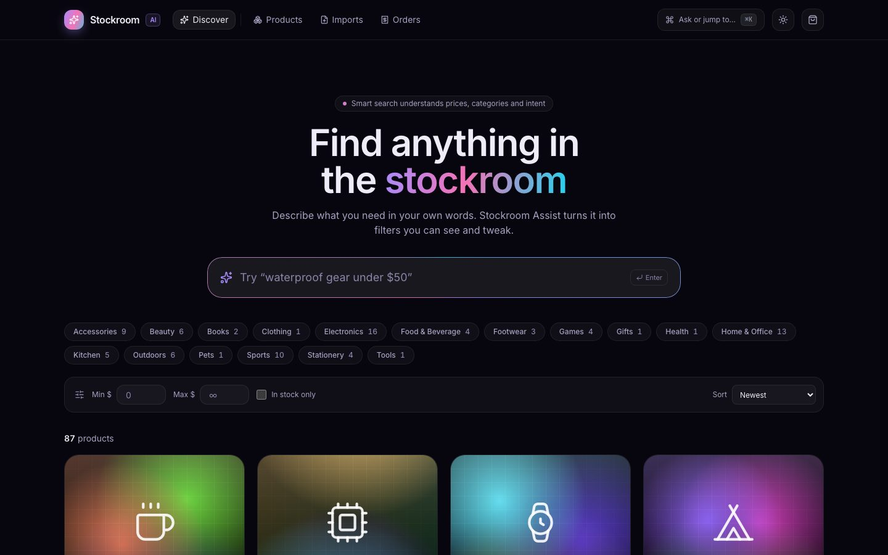

---

## 3. Test data reference

### 3.1 Reference products (from the seeded catalog)

These products exist after every fresh start and are useful for specific tests.

| SKU | Name | Category | Price | Stock | Useful for |
|---|---|---|---|---|---|
| RS-001 | Running Shoes | Footwear | $94.99 | 120 | Normal purchase; exact-SKU search |
| RS-050 | Running Shoes | Footwear | $49.99 | 200 | Same name, different SKU |
| BS-021 | Bluetooth Speaker | Electronics | $59.99 | 110 | Typo search (`bluetoth`) |
| BS-099 | Bluetooth Speaker | Electronics | $24.99 | 300 | Cheap electronics |
| WM-042 | Wireless Mouse | Electronics | $29.99 | 75 | Imported from `$29.99` (currency symbol stripped) |
| DL-045 | Dog Leash | Pets | $18.99 | 230 | Payment-outcome tests |
| **VC-001** | Vintage Clock | Home & Office | $299.99 | **0** | **Out of stock** |
| **MB-001** | Mystery Box | Gifts | **$0.00** | 50 | **Free order** (no payment step) |
| SD-004 | Standing Desk | Home & Office | $449.99 | 15 | Over-limit order (with AP-002) |
| AP-002 | Air Purifier | Home & Office | $189.99 | 20 | Over-limit order (with SD-004) |
| XS-001 | `<script>alert('xss')</script>` | Electronics | $19.99 | 100 | Hostile text shown as plain text |
| SQL-001 | `Robert'); DROP TABLE products;--` | Games | $9.99 | 50 | Hostile text shown as plain text |

Not in the catalog (rejected by the seed import): YM-015 (price `free`), DL-007 (stock `-5`), HD-099 (empty name), WS-001 (whitespace name), GC-025 (empty category).

### 3.2 Test cards

Use any future expiry date (for example `12/30`), any 3-digit CVC (for example `123`) and any name. The checkout page has buttons that fill these in.

| Card number | Result | What you see |
|---|---|---|
| `4242 4242 4242 4242` | Approved | Order **Confirmed**, card •••• 4242 |
| `4000 0000 0000 0002` | Declined | Order **Cancelled**: "The card was declined by the issuer." |
| `4000 0000 0000 9995` | Declined | Order **Cancelled**: "The card has insufficient funds." |
| `4000 0000 0000 0119` | Fails once, then approved | Order **Confirmed** about 1 second later than usual (automatic retry) |
| `5555 5555 5555 4444` (or any Luhn-valid card) | Approved | Order **Confirmed**, card •••• 4444 |
| `4242 4242 4242 4241` | Invalid | Field error "Card number is invalid" (checksum fails) |
| Any card, order total above **$10,000** | Declined | Order **Cancelled**: "The amount exceeds the payment limit of $10,000." |

### 3.3 CSV files for import tests

Ready-made files are in [`docs/manual/test-data/`](test-data). These are the expected results when each file is imported on a fresh seed:

| File | Purpose | Expected result |
|---|---|---|
| [`products-valid.csv`](test-data/products-valid.csv) | 5 new products (`MAN-001`–`MAN-005`) | Completed · 5 created · 0 rejected |
| [`products-mixed-quality.csv`](test-data/products-mixed-quality.csv) | Every kind of problem in one file | Completed with issues · 4 created · 5 rejected · 1 warning · 1 blank line |
| [`products-missing-header.csv`](test-data/products-missing-header.csv) | Only 3 of the 7 required columns | Rejected: "missing required columns: description, category, stock, weight_kg" |
| [`products-update-existing.csv`](test-data/products-update-existing.csv) | Reordered, capitalized headers; updates seeded SKUs | Completed · 0 created · 2 updated (RS-001 → $79.99, VC-001 → stock 5) · 1 unchanged (MB-001) |
| `Code Challenge E-Commerce.csv` (repository root) | The challenge's example file | 87 unchanged on a fresh seed (it was already imported) · 5 rejected · 3 warnings |

Line-by-line results for `products-mixed-quality.csv`:

| Line | SKU | Problem in the file | Result |
|---|---|---|---|
| 2 | MIX-001 | Price `$34.90` | Accepted, then replaced by line 9 |
| 3 | MIX-002 | Price `"1,299.00"`, empty weight | Accepted: $1,299.00, no weight |
| 4 | MIX-003 | Price `free` | **Rejected**: `INVALID_PRICE` |
| 5 | MIX-004 | Stock `-3` | **Rejected**: `NEGATIVE_STOCK` |
| 6 | MIX-005 | Name is only spaces | **Rejected**: `NAME_REQUIRED` |
| 7 | MIX-006 | Category empty | **Rejected**: `CATEGORY_REQUIRED` |
| 8 | MIX-007 | Weight `heavy` | **Rejected**: `INVALID_WEIGHT` |
| 9 | MIX-001 | Same SKU as line 2 | Accepted (last one wins); **warning** `DUPLICATE_SKU_IN_FILE` |
| 10 | — | `,,,,,,` | Skipped as a blank line |
| 11 | MIX-008 | Name with comma and quotes | Accepted: `Comma, Inc. Mug` |
| 12 | MIX-009 | Name `<b>Bold</b> Candle` | Accepted, shown as literal text |

---

## 4. Shopper use cases (Discover)

### UC-S1 — Browse the catalog

**Goal:** see what is for sale.

1. Open http://localhost:8080/shop.
2. Click a category chip (for example **Electronics**). Click it again to remove the filter.
3. Use **Sort** to order by price or name, and **Next** to page through the results.

**Expected:**
- 87 products on a fresh seed, 24 per page.
- Each card shows the category, the stock status (In stock / Only N left / Out of stock), the price and the SKU.
- The URL changes with every filter, so you can copy it and share the exact view.

### UC-S2 — Search in your own words (smart search)

**Goal:** find products by describing them.

**Test data:** type `cheap electronics under $30 in stock`.

**Expected:**
- Four chips appear under the search box: **Up to $30**, **In stock**, **Lowest price first** and **Electronics**.
- The Electronics chip is highlighted, and 8 products are shown, cheapest first.
- Removing a chip (✕) removes those words from the search box and updates the results.

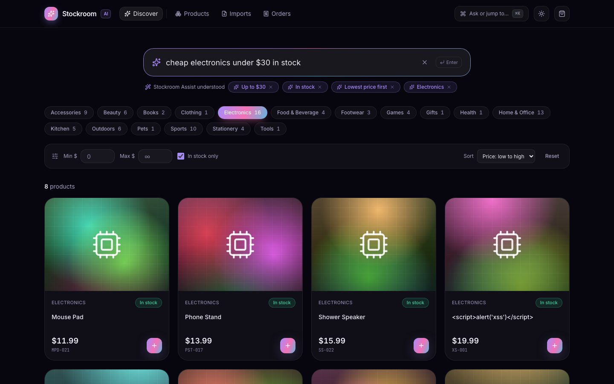

More phrases to try:

| Type this | Expected chips |
|---|---|
| `waterproof gear under $50` | Up to $50 (keywords: "waterproof gear") |
| `sports between $10 and $40` | From $10 · Up to $40 · Sports |
| `home and office lamp` | Home & Office (keywords: "lamp") |
| `gifts below 30` | Up to $30 · Gifts |
| `newest kitchen` | Newest first · Kitchen |

> Smart search runs entirely in your browser with fixed rules. It is not an AI model and needs no internet connection.

### UC-S3 — Forgiving search and filters

| Test data | Expected |
|---|---|
| Search `bluetoth` (typo) | Both Bluetooth Speakers are found |
| Search `runing shoez` (two typos) | Both Running Shoes products, no hint (every word matched) |
| Search `wirless speakr` (two typos, no product has both words) | Speakers first, then wireless items, with the hint "No product matches every word … Showing the closest matches, best first." |
| Search `rs-001` | Running Shoes (RS-001) is the **first** result |
| Search `RS-0` | Both Running Shoes products (SKU prefix) |
| Min $ `10`, Max $ `20`, tick **In stock only** | Only products between $10.00 and $20.00 that are available |
| Search `zzzz` | "Nothing matches yet" with a button to clear the filters |
| Search `script` | Product `<script>alert('xss')</script>` shown as plain text, **no pop-up** |

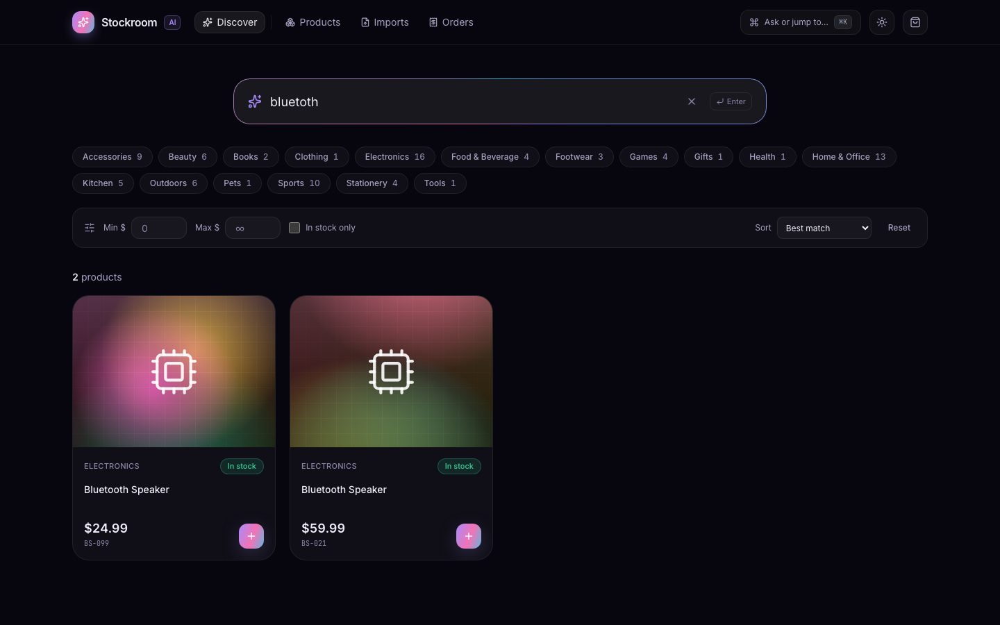

### UC-S4 — Jump anywhere with the command palette

1. Press **⌘K** (Mac) or **Ctrl+K** (Windows/Linux), or click "Ask or jump to…".
2. Type `speaker`.
3. Pick a product to open it, or pick a destination (Cart, Studio · Products, Import a CSV, …).

**Expected:** live product results with prices, navigation shortcuts and a theme switch.

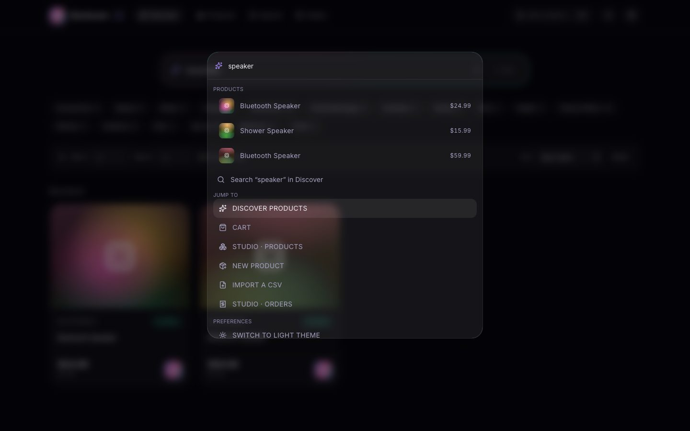

### UC-S5 — View a product and add it to the cart

**Test data:** Running Shoes (RS-001).

1. Open the product from Discover (or search `rs-001`).
2. Press **+** to choose 2, then click **Add to cart**.
3. Open a second product (Bluetooth Speaker BS-021) and add 1.

**Expected:**
- **Product page:** shows the highlights (taken from the description), available stock, weight and category, and a toast confirms the item was added.
- **Cart badge:** shows 3.

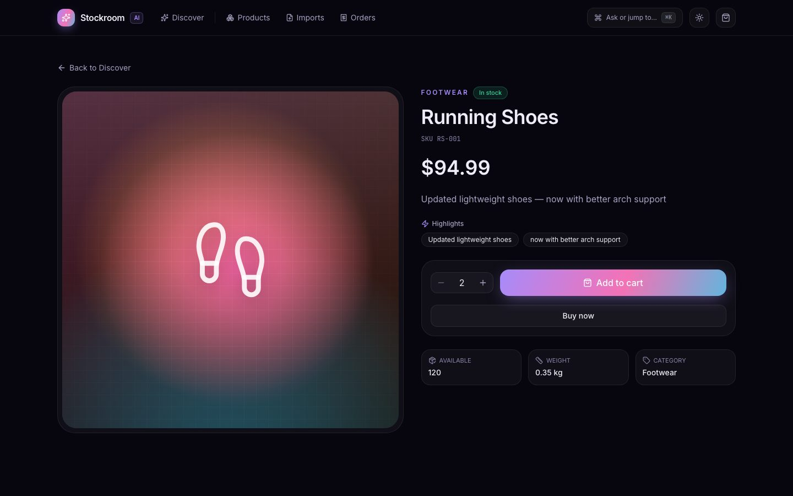

Open the cart (bag icon):

**Expected:**
- **Lines:** each line can be changed (− / +) or removed.
- **Total:** $249.97 (2 × $94.99 + $59.99).
- **Quantity limit:** you can't add more units than are in stock. The cart is kept on this device until the order is confirmed.

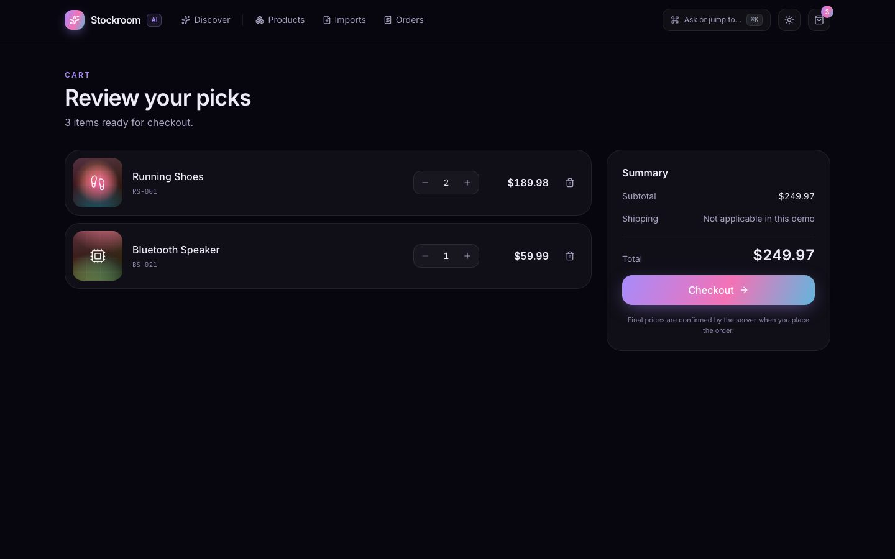

### UC-S6 — Buy with an approved card

**Test data:** card `4242 4242 4242 4242`, expiry `12/30`, CVC `123`, name `Ada Lovelace`, email `ada@example.com`.

1. From the cart click **Checkout**.
2. Fill the contact fields, then click the **4242 4242 4242 4242** test card button (it fills number, expiry and CVC).
3. Click **Place order**.

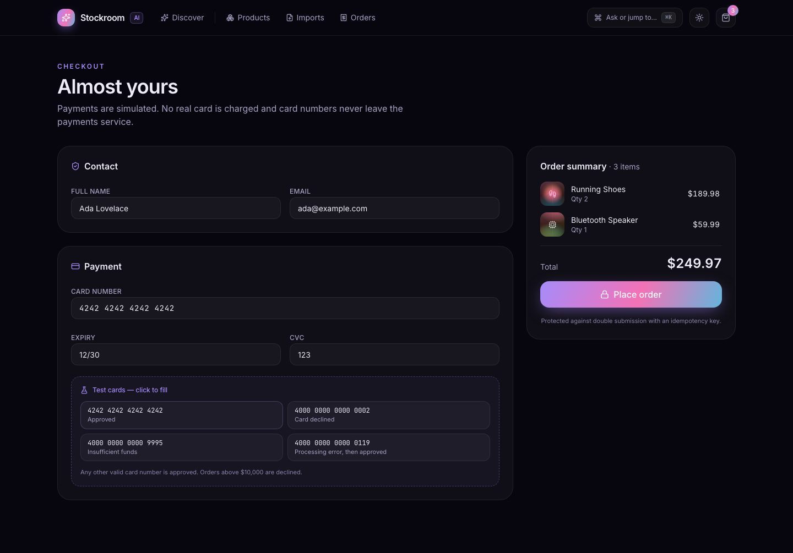

**Expected:**
- **While processing:** the order page shows each step live: *Order received → Reserving stock → Processing payment → Confirmed*.
- **Result:** within about 2 seconds the order shows **Order confirmed**, with the items, the $249.97 total and "Card •••• 4242 · succeeded".
- **Afterwards:** the cart is emptied, and stock drops in the Studio (RS-001 120 → 118).

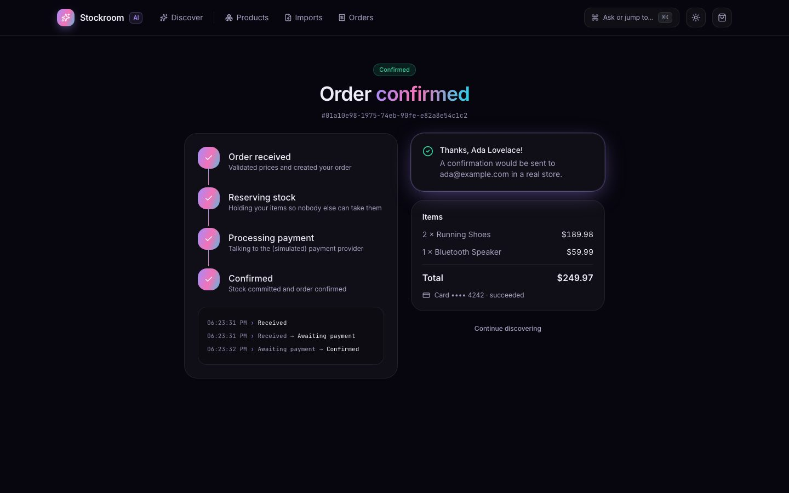

> Clicking **Place order** twice never creates two orders. Every attempt carries an idempotency key.

### UC-S7 — Payment declined

**Test data:** add Dog Leash (DL-045); pay with `4000 0000 0000 0002`.

**Expected:**
- **Order page:** shows **Order cancelled** with "The card was declined by the issuer.", and the payment step is marked failed.
- **Stock:** released, so DL-045 stays at 230 available.
- **Cart:** kept, so you can retry with another card.

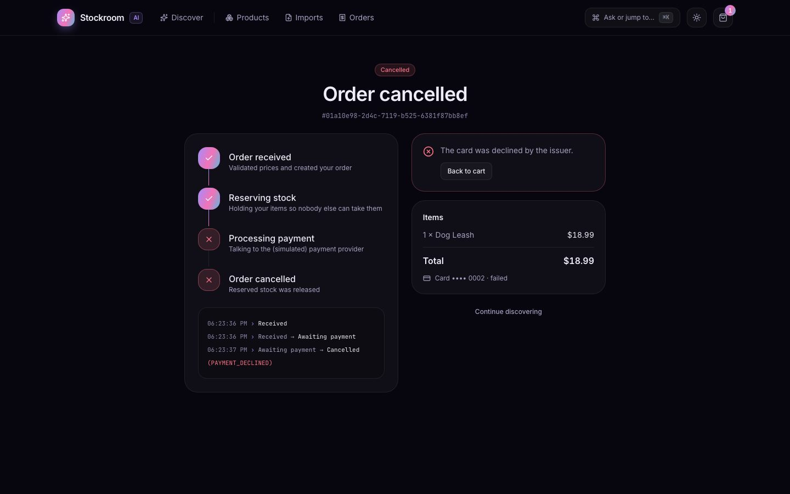

The other outcomes from [3.2](#32-test-cards) work the same way: `…9995` gives insufficient funds, and `…0119` gives a confirmation after one automatic retry.

### UC-S8 — Out-of-stock product

**Test data:** Vintage Clock (VC-001), stock 0.

**Expected:** the product shows **Out of stock**, the buy buttons are disabled and the artwork is greyed out. Through the API, ordering it returns `409 INSUFFICIENT_STOCK`.

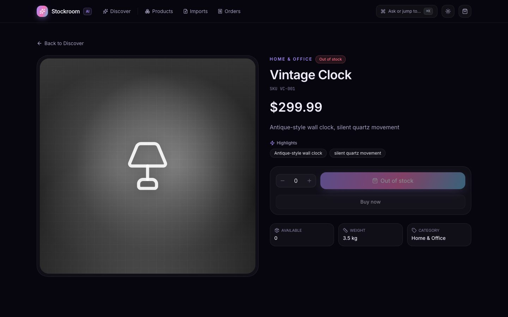

### UC-S9 — Free order (no payment)

**Test data:** Mystery Box (MB-001, $0.00); any valid card.

**Expected:** the order is **Confirmed** with total $0.00. The *Processing payment* step is skipped ("Nothing to charge for a free order"), and no card is charged.

### UC-S10 — Order over the payment limit

**Test data:** Standing Desk (SD-004) × 15 and Air Purifier (AP-002) × 20 (total $10,549.65); card `4242 4242 4242 4242`.

**Expected:** **Order cancelled** with "The amount exceeds the payment limit of $10,000." Stock is released, so SD-004 is back to 15 available.

### UC-S11 — Price changed while shopping

1. Add any product to the cart, but don't open the cart page.
2. In another tab, open the same product in **Studio** and change its price, for example to $15.00. Save.
3. Go back to the first tab, open `/shop/checkout`, fill the form and click **Place order**.

**Expected:**
- **First attempt:** a warning says "Some prices changed. Review the new total and place the order again." The summary now shows the new price, and **no order is created**.
- **Second click:** the order is placed at the new price.

---

## 5. Admin use cases (Studio)

### UC-A1 — Find products

Open **Products** (http://localhost:8080/admin/products).

**Expected:**
- **Table:** shows the product, category, price, stock (with units reserved by open orders), status and last update.
- **Search:** the search box (name, SKU or description) and the category filter narrow the table immediately.

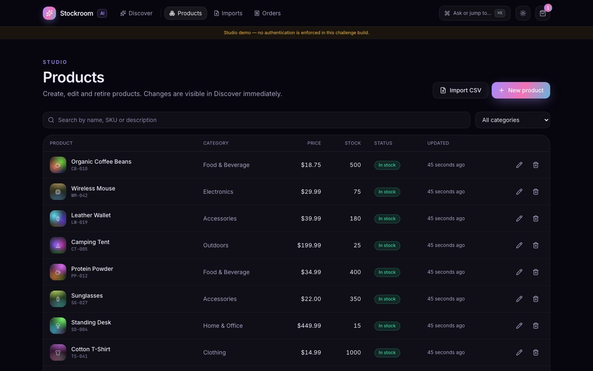

### UC-A2 — Create a product

**Test data:**

| Field | Value |
|---|---|
| SKU | `man-100` (saved as `MAN-100`) |
| Category | `Home & Office` (pick from the list or type a new one) |
| Name | `Walnut Monitor Riser` |
| Description | `Solid walnut, 60 cm wide, cable cut-out` |
| Price (USD) | `89.00` |
| Stock | `25` |
| Weight (kg) | `2.4` |

1. Click **New product**, fill the form and watch the **Live preview** card on the right.
2. Click **Create product**.

**Expected:** a "Product created" toast. The product appears in the table and in Discover right away.

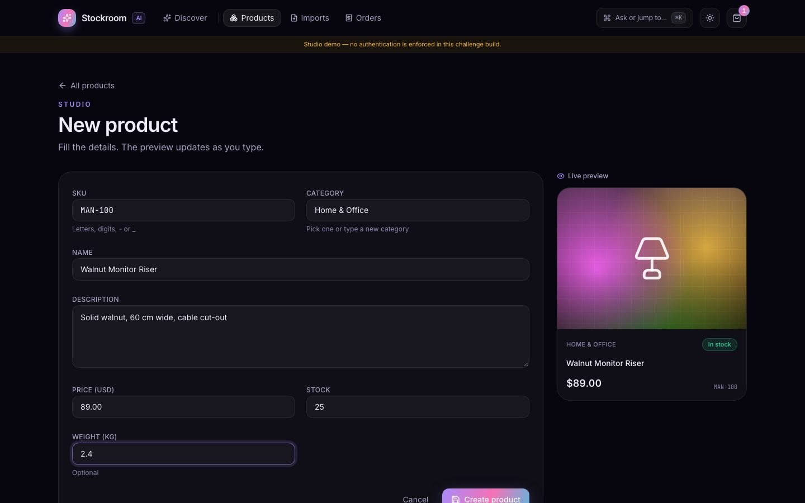

### UC-A3 — Validation errors

| Test data | Expected message |
|---|---|
| Submit an empty form | "SKU is required", "Name is required", "Enter a price like 19.99" |
| SKU `RS-001` (already exists) | "This SKU is already used by another product" |
| Price `free` or `1.999` | "Enter a price like 19.99" |
| Stock `-1` or `2.5` | "Whole number, 0 or more" |
| Weight `heavy` | "Kilograms with up to 3 decimals" |

### UC-A4 — Edit a product

1. Click the ✎ icon on `MAN-100`.
2. Change the price to `79.00`, then click **Save changes**.

**Expected:**
- **Save:** a "Changes saved" toast, and the new price in Studio and Discover.
- **SKU:** the field is locked, because SKUs are permanent.

### UC-A5 — Two people edit the same product

1. Open `MAN-100` for editing in **two browser windows**.
2. In window 1, change the price to `79.00` and save.
3. In window 2 (still showing the old version), change Stock to `30` and save.

**Expected:**
- **Window 2:** shows **"Someone else changed this product"**.
- **Reload latest:** loads the new price ($79.00) and keeps your stock change (30). Saving again then succeeds.
- **No lost update:** neither person's change is silently overwritten.

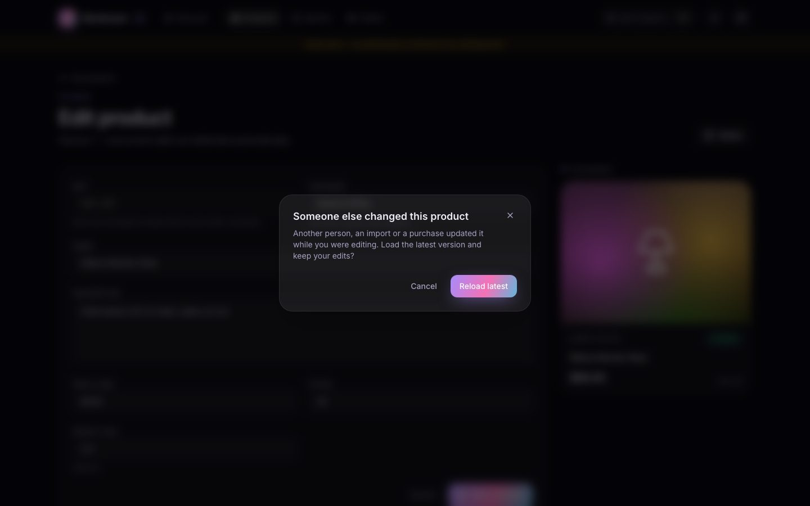

### UC-A6 — Delete a product

1. Click the 🗑 icon on `MAN-100`, then confirm **Delete**.

**Expected:**
- **Product:** disappears from Studio and Discover.
- **Past orders:** keep their copy of the product.
- **Reserved stock:** if units are reserved by an order in progress, deletion is refused with an explanation. Try again later.

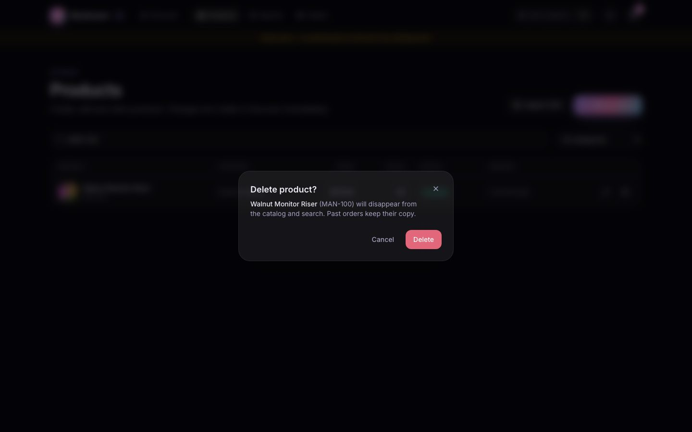

### UC-A7 — Import a clean CSV

**Test data:** [`products-valid.csv`](test-data/products-valid.csv).

1. Open **Imports** (http://localhost:8080/admin/imports).
2. Drag the file onto the drop zone, or click it to browse.

**Expected:**
- **Report:** opens automatically, showing **100%** of rows accepted and **5 created**.
- **Catalog:** `MAN-001`…`MAN-005` are now searchable in Discover.

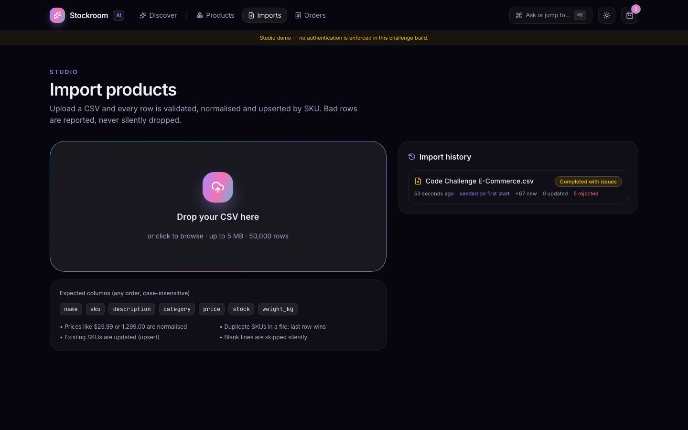

### UC-A8 — Import a file with problems

**Test data:** [`products-mixed-quality.csv`](test-data/products-mixed-quality.csv).

**Expected:**
- **Counts:** 50% of rows accepted · **4 created** · **5 rejected** · **1 warning** · **1 blank line**.
- **Issues table:** each rejected row with its line number, SKU, field, value and reason (see [3.3](#33-csv-files-for-import-tests)).
- **Filters:** the *Errors* and *Warnings* tabs filter the table.
- **Download issues CSV:** exports the problems so you can fix them in a spreadsheet. Values such as `-3` are exported as `'-3`, so a spreadsheet never runs them as formulas.

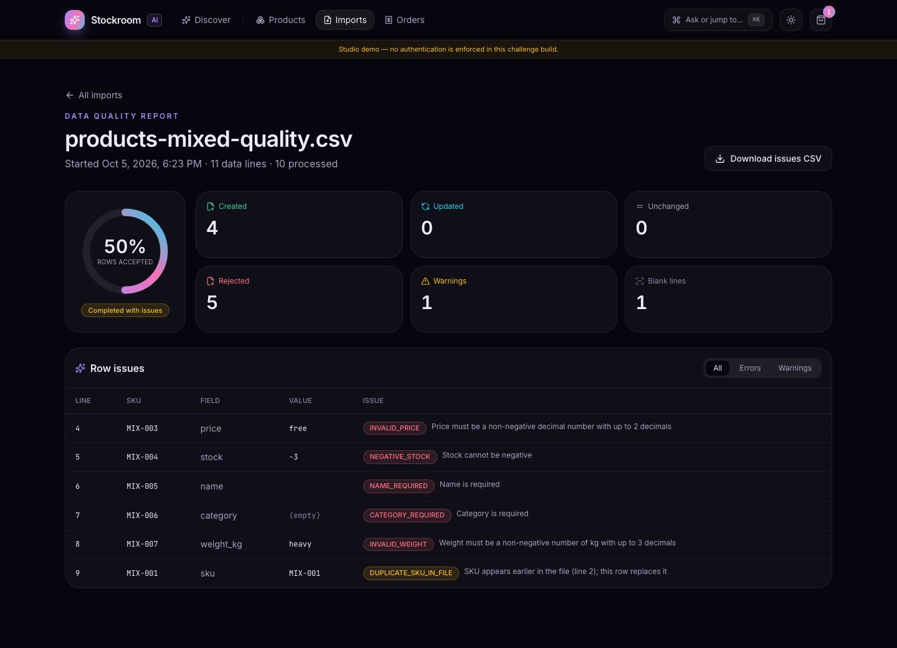

### UC-A9 — Import a file with missing columns

**Test data:** [`products-missing-header.csv`](test-data/products-missing-header.csv).

**Expected:**
- **Message:** an error toast reads "The CSV header is missing required columns: description, category, stock, weight_kg".
- **Nothing imported:** no product is created.
- **History:** the attempt is listed as **Failed**.

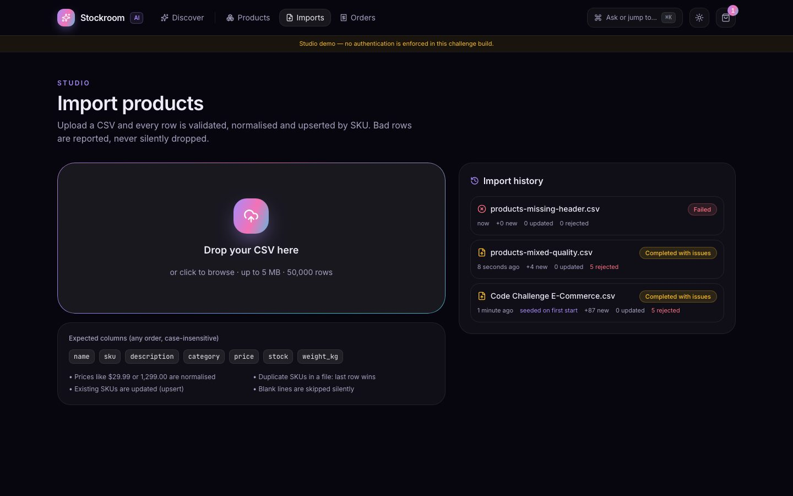

### UC-A10 — Update existing products from a CSV

**Test data:** [`products-update-existing.csv`](test-data/products-update-existing.csv). Its columns are in a different order with different capitalization, which is allowed.

**Expected:**
- **Counts:** 0 created · **2 updated** · **1 unchanged**.
- **Running Shoes (RS-001):** now $79.99 with 150 in stock.
- **Vintage Clock (VC-001):** back in stock (5).
- **Re-import:** importing the same file again gives 3 unchanged. Imports are safe to repeat.

### UC-A11 — Review the challenge's example import

1. In **Imports**, open the history entry marked *seeded on first start* (`Code Challenge E-Commerce.csv`).

**Expected:** 97 data lines · 2 blank · 95 processed · **87 created** · **5 rejected** · **3 warnings**.
- **Errors tab:** YM-015 (price `free`), DL-007 (stock `-5`), HD-099 and WS-001 (no name), GC-025 (no category).
- **Warnings:** RS-001 and BS-021 appear more than once in the file; the last row wins.

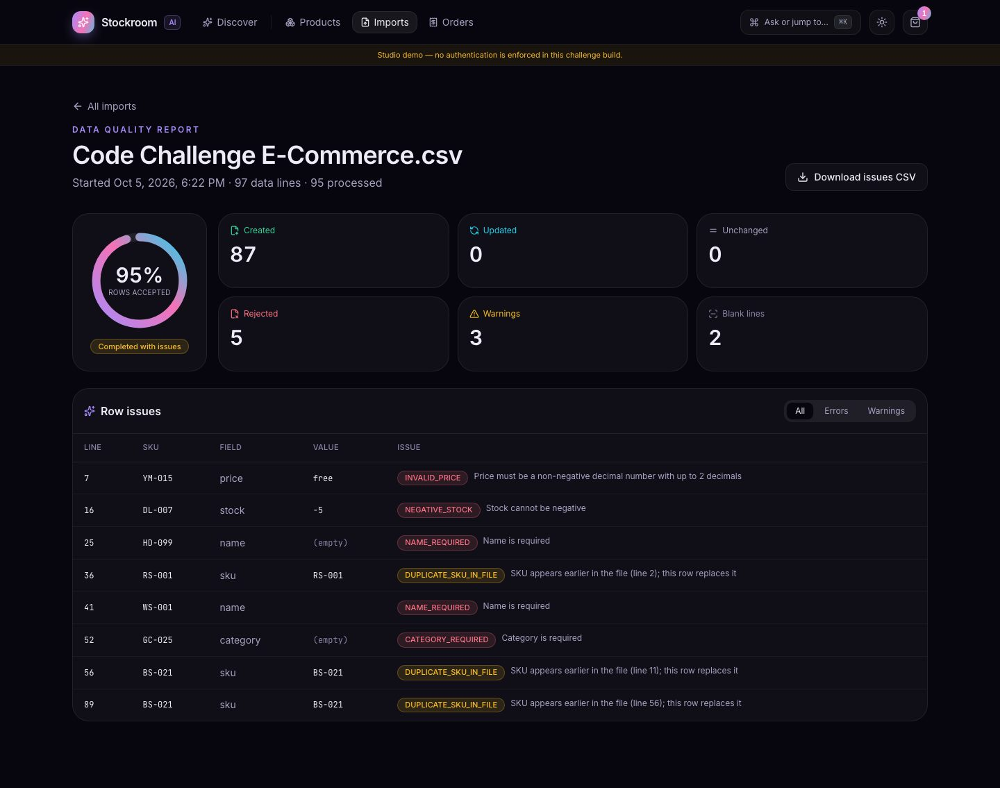

### UC-A12 — Follow orders

1. Open **Orders** (http://localhost:8080/admin/orders) and filter by status (Received, Awaiting payment, Confirmed, Cancelled).
2. Open an order.

**Expected:**
- **List:** refreshes by itself every few seconds.
- **Order detail:** shows the customer, lines, total, payment result and the timestamped step history.

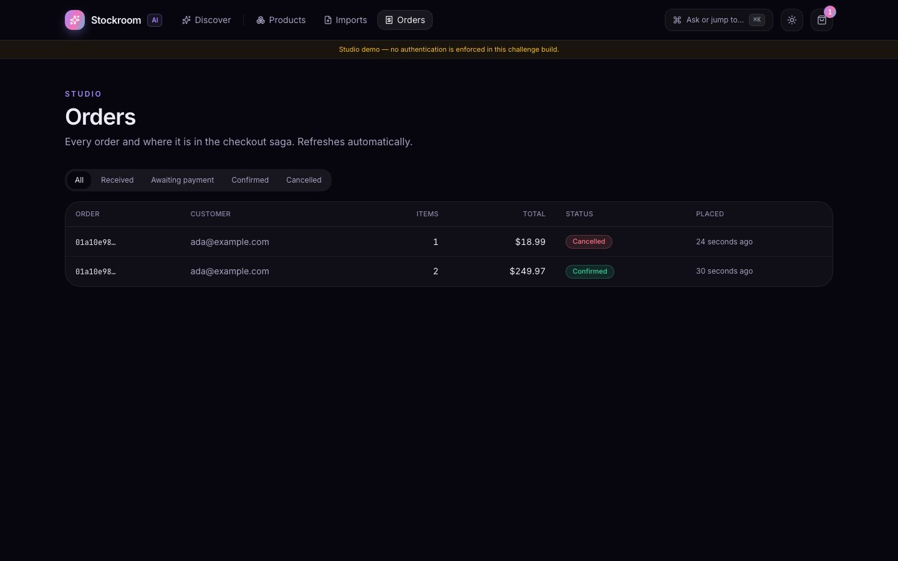

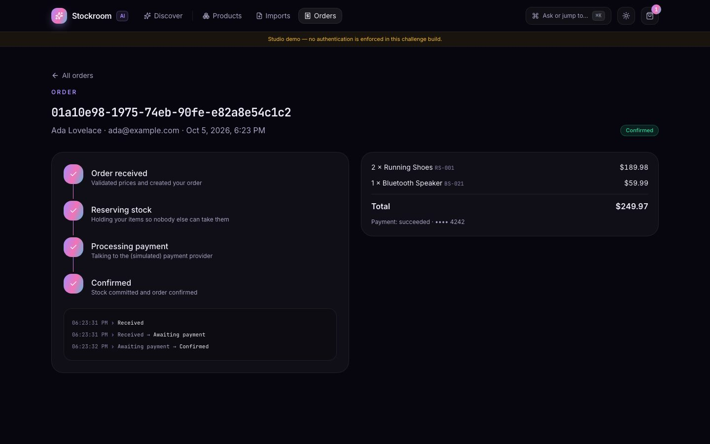

---

## 6. Platform use cases

### UC-P1 — Light theme and mobile

- Click ☀ in the top bar (or use the command palette) to switch to the light theme. The choice is remembered on this device.
- Open the site on a phone, or narrow the browser to about 400 px. Everything stays usable, and the top navigation collapses to icons.

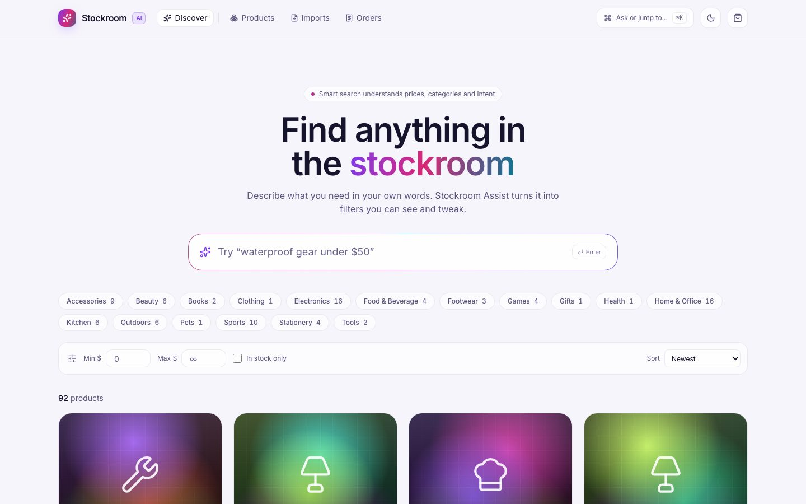

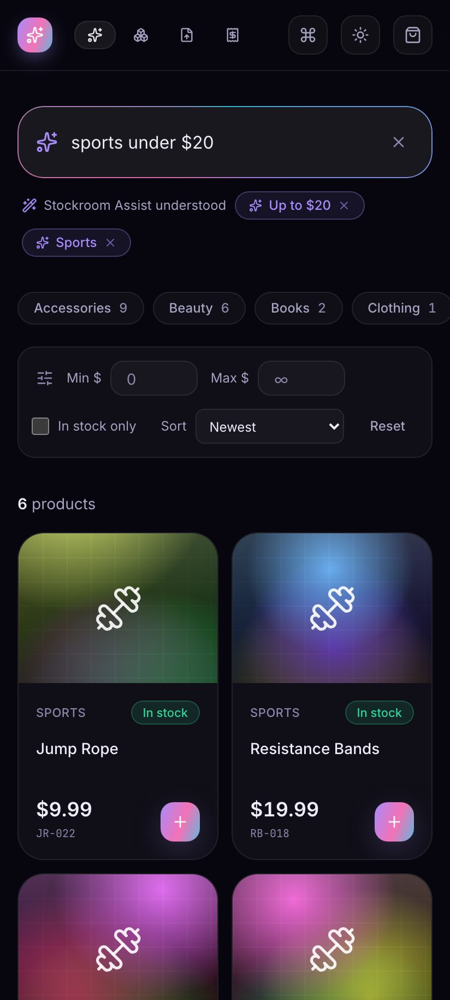

### UC-P2 — Explore and call the API

1. Open http://localhost:8080/api/docs.
2. Expand an operation (for example `GET /products`), click **Try it out**, then **Execute**.

**Expected:**
- **Documentation:** every public endpoint is documented, with request and response schemas.
- **Errors:** they use `application/problem+json` with a `code` (for example `VALIDATION`, `DUPLICATE_SKU`, `VERSION_CONFLICT`).

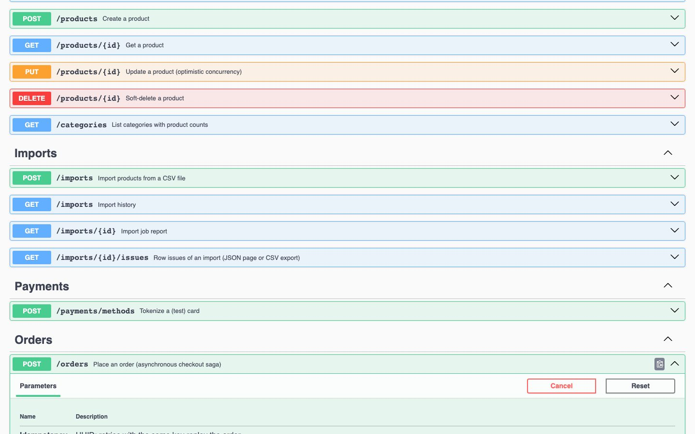

Quick checks from a terminal:

```bash
API=http://localhost:8080/api/v1
curl "$API/products?q=bluetoth&pageSize=3"                    # typo-tolerant search
curl -i "$API/products/00000000-0000-7000-8000-000000000000"   # 404 PRODUCT_NOT_FOUND
curl -X POST "$API/imports" -F "file=@docs/manual/test-data/products-valid.csv"
```

### UC-P3 — Follow a purchase across services (tracing)

1. Start with tracing: `make up-tracing`.
2. Buy something (UC-S6).
3. Open http://localhost:16686, choose service **gateway**, then **Find Traces**, and open the `POST` trace.

**Expected:**
- **One trace, four services:** gateway, orders, catalog and payments.
- **Spans:** every HTTP call, database query and message, for example `orders.order.created.v1 publish` → `orders.order.created.v1 process`.

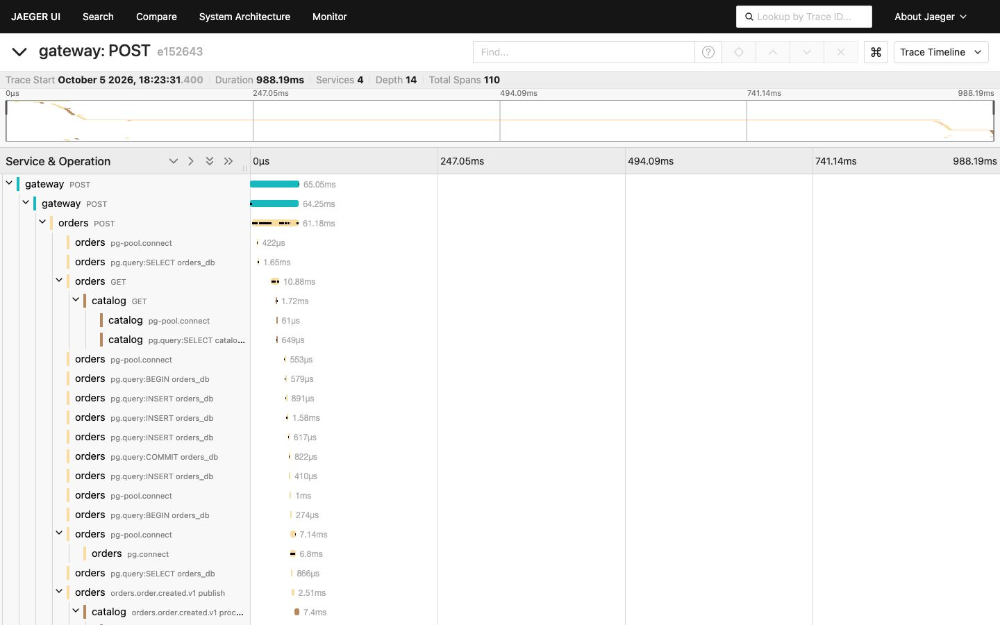

### UC-P4 — Watch the message queues

1. Open http://localhost:15672 and log in with `stockroom` / `stockroom`.
2. Open **Queues**.

**Expected:**
- **Main queues:** `catalog.inventory`, `orders.saga` and `payments.commands`, each with 1 consumer.
- **Companion queues:** `.retry.1s/5s/30s` and `.dlq` for each main queue.
- **After buying:** messages flow through, and the `.dlq` queues stay at 0.

### UC-P5 — Resilience: restart the message broker

1. Place an order and immediately run `docker compose restart rabbitmq`.

**Expected:** the order still reaches **Confirmed** (or Cancelled for a declined card) within a few seconds of RabbitMQ coming back. No service crashes, and `docker compose ps` shows everything healthy.

---

## 7. Manual test checklist

Copy this table into your test notes. Reset the stack first (`docker compose down -v && docker compose up -d --wait`).

| ID | Use case | Key test data | Expected | Pass |
|---|---|---|---|---|
| UC-S1 | Browse | Category chip Electronics | 16 products, URL updated | ☐ |
| UC-S2 | Smart search | `cheap electronics under $30 in stock` | 4 chips, 8 products, cheapest first | ☐ |
| UC-S3 | Typo / SKU / XSS search | `bluetoth`, `runing shoez`, `wirless speakr`, `rs-001`, `script` | Speakers found; partial-match hint for `wirless speakr`; RS-001 first; no pop-up | ☐ |
| UC-S4 | Command palette | ⌘K, `speaker` | Products listed, navigation works | ☐ |
| UC-S5 | Cart | RS-001 ×2 + BS-021 ×1 | Total $249.97 | ☐ |
| UC-S6 | Approved purchase | 4242 4242 4242 4242 | Confirmed, cart emptied, stock −2 | ☐ |
| UC-S7 | Declined purchase | 4000 0000 0000 0002 | Cancelled with reason, stock unchanged | ☐ |
| UC-S8 | Out of stock | VC-001 | Buy buttons disabled | ☐ |
| UC-S9 | Free order | MB-001 | Confirmed, payment step skipped | ☐ |
| UC-S10 | Payment limit | SD-004 ×15 + AP-002 ×20 | Cancelled: over $10,000 | ☐ |
| UC-S11 | Price changed | Edit price while item in cart | Warning, then order at new price | ☐ |
| UC-A1 | Find products | Search `MAN`, category filter | Table filters live | ☐ |
| UC-A2 | Create product | MAN-100 data above | Created, visible in Discover | ☐ |
| UC-A3 | Validation | Empty form, `RS-001` | Field messages shown | ☐ |
| UC-A4 | Edit product | Price 79.00 | Saved, SKU locked | ☐ |
| UC-A5 | Concurrent edit | Two windows | Conflict dialog, both changes kept | ☐ |
| UC-A6 | Delete product | MAN-100 | Removed from catalog | ☐ |
| UC-A7 | Clean import | products-valid.csv | 5 created | ☐ |
| UC-A8 | Mixed import | products-mixed-quality.csv | 4 created, 5 rejected, 1 warning | ☐ |
| UC-A9 | Bad header | products-missing-header.csv | Error, nothing imported | ☐ |
| UC-A10 | Update via CSV | products-update-existing.csv | 2 updated, 1 unchanged | ☐ |
| UC-A11 | Seed report | Seeded import | 87 / 5 / 3 | ☐ |
| UC-A12 | Orders | Orders page | Statuses and history visible | ☐ |
| UC-P1 | Theme and mobile | ☀, narrow window | Light theme; usable on mobile | ☐ |
| UC-P2 | API docs | /api/docs | Try it out works | ☐ |
| UC-P3 | Tracing | make up-tracing | One trace, 4 services | ☐ |
| UC-P4 | Queues | RabbitMQ console | DLQs empty | ☐ |
| UC-P5 | Broker restart | restart rabbitmq | Order still completes | ☐ |

Automated equivalents: `make smoke` (19 API checks) and `pnpm test:e2e` (32 browser tests, run on the host with Node and pnpm installed).

## 8. Troubleshooting

| Problem | What to do |
|---|---|
| The page says "Could not reach the server" | Run `docker compose ps` and wait until every service is `healthy` |
| Numbers differ from this manual | Data changed during testing: `docker compose down -v && docker compose up -d --wait` |
| Port 8080 is busy | `WEB_PORT=8081 docker compose up -d --wait`, then use http://localhost:8081 |
| An order stays in "Working on your order…" | Check `docker compose ps` (payments or RabbitMQ restarting); the order completes when they are back |
| Jaeger shows no traces | Start with `make up-tracing` (tracing is off by default) |
| Import says "Only .csv files are supported" | Save the file with a `.csv` extension (UTF-8, comma-separated) |

To regenerate the screenshots after UI changes, start from a fresh, tracing-enabled stack and run:

```bash
docker compose --profile observability down -v && make up-tracing
pnpm --filter @stockroom/web manual:screenshots
```

## Videos

| Video | Length | What it shows |
|---|---|---|
| [stockroom-live-test.mp4](videos/stockroom-live-test.mp4) | 2:23 | Claude running 23 use cases live against the Docker stack, with captions and a PASS check per step |
| [stockroom-e2e-suite.mp4](videos/stockroom-e2e-suite.mp4) | 1:27 | All 30 automated Playwright tests, one after another ([index](videos/e2e-suite-index.json)) |

Chapters of the live test:

| Time | Step | Title |
|---|---|---|
| 0:00 | INTRO | Fresh stack, seeded catalog |
| 0:05 | UC-S1 | Browse the catalog |
| 0:09 | UC-S2 | Search in your own words |
| 0:15 | UC-S3 | Typo-tolerant and hostile search |
| 0:21 | UC-S4 | Command palette |
| 0:25 | UC-S5 | Build a cart |
| 0:31 | UC-S6 | Checkout with an approved card |
| 0:40 | UC-S7 | Declined card |
| 0:49 | UC-S8 | Out-of-stock product |
| 0:53 | UC-S9 | Free order |
| 1:03 | UC-A1 | Studio · products |
| 1:07 | UC-A3 | Validation |
| 1:10 | UC-A2 | Create a product |
| 1:23 | UC-A5 | Concurrent edit is detected |
| 1:29 | UC-A6 | Delete a product |
| 1:33 | UC-A8 | Import a CSV with problems |
| 1:39 | UC-A9 | Reject a CSV with missing columns |
| 1:44 | UC-A11 | The challenge CSV, seeded on first start |
| 1:48 | UC-A12 | Follow orders in the Studio |
| 1:52 | UC-P1a | Light theme |
| 1:58 | UC-P1b | Mobile layout |
| 2:03 | UC-P2 | API documentation |
| 2:07 | UC-P3 | One purchase = one distributed trace |
| 2:13 | UC-P4 | Idempotent order placement |
| 2:17 | END | All 23 checks passed |

To re-record: reset with tracing (`docker compose --profile observability down -v && make up-tracing`), then run `npx playwright test -c playwright.live.config.ts` in `apps/web` and convert the WebM in `apps/web/live-results/video/` with `ffmpeg -i <file>.webm -c:v libx264 -crf 26 -pix_fmt yuv420p -movflags +faststart out.mp4`.
