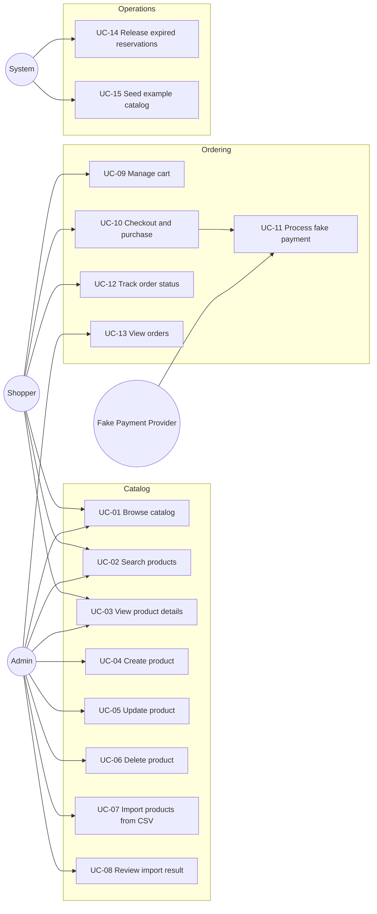

# Stockroom — Use Cases

Source: `requeriments.txt`, `docs/csv-data-profile.md`.
Status: **draft**. Items marked ⚠️ are assumptions pending confirmation; they will be settled in `/opsx:explore` and recorded in the OpenSpec proposals.

## Actors

| Actor | Description |
|---|---|
| **Admin** | Manages the catalog: products CRUD and CSV imports. ⚠️ No real authentication; admin area is a separate route (`/admin`). |
| **Shopper** | Browses, searches and purchases products (`/shop`). Anonymous, no account. |
| **Payment Provider (fake)** | Simulated provider inside the payments service. Approves or declines using deterministic rules. |
| **System** | Background processes: import processing, checkout saga, reservation expiry, initial seeding. |

## Overview

| ID | Use case | Primary actor | Service(s) | Requirement |
|---|---|---|---|---|
| UC-01 | Browse catalog | Shopper, Admin | catalog | UI for products |
| UC-02 | Search products | Shopper, Admin | catalog | Search for Products |
| UC-03 | View product details | Shopper, Admin | catalog | CRUD (read) |
| UC-04 | Create product | Admin | catalog | CRUD (create) |
| UC-05 | Update product | Admin | catalog | CRUD (update) |
| UC-06 | Delete product | Admin | catalog | CRUD (delete) |
| UC-07 | Import products from CSV | Admin | catalog | Import from CSV |
| UC-08 | Review import result | Admin | catalog | Import from CSV |
| UC-09 | Manage cart | Shopper | web | Purchase products |
| UC-10 | Checkout and purchase | Shopper | orders, catalog, payments | Purchase products |
| UC-11 | Process fake payment | Payment Provider | payments | Fake the payment |
| UC-12 | Track order status | Shopper | orders | Purchase products |
| UC-13 | View orders | Admin | orders | Supporting (operability) |
| UC-14 | Release expired reservations | System | catalog | Supporting (stock correctness) |
| UC-15 | Seed example catalog | System | catalog | Use example CSV, runs locally |

---

## UC-01 Browse catalog

- **Actor:** Shopper, Admin
- **Goal:** See available products in a paginated list.
- **Preconditions:** None.
- **Main flow:**
  1. Actor opens the product list.
  2. System returns the first page (default 20 items) sorted by newest.
  3. Each item shows name, SKU, category, price and stock status.
  4. Actor navigates pages.
- **Alternative flows:**
  - A1. Catalog empty → empty state with a link to import (admin) or a friendly message (shopper).
  - A2. Product with stock 0 → shown with "Out of stock" badge; "Add to cart" disabled.
- **Exceptions:** E1. Catalog service unavailable → error state with retry.
- **Business rules:**
  - Soft-deleted products are never listed.
  - Shopper view hides products with stock 0? ⚠️ Proposed: show them flagged as out of stock.
  - Page size max 100.
- **Postconditions:** None (read-only).

## UC-02 Search products

- **Actor:** Shopper, Admin
- **Goal:** Find products by keyword and narrow results.
- **Preconditions:** None.
- **Main flow:**
  1. Actor types a query (debounced).
  2. Actor optionally filters by category, price range and in-stock only, and chooses a sort (relevance, price, name, newest).
  3. System returns ranked, paginated results; filters and query are reflected in the URL.
- **Alternative flows:**
  - A1. Empty query → behaves as UC-01 with filters applied.
  - A2. Typo or partial word (e.g. `bluetoth`, `RS-0`) → trigram/prefix match still returns results.
  - A3. Query matches SKU exactly → that product ranks first.
  - A4. No results → "no results" state with option to clear filters.
- **Exceptions:**
  - E1. Invalid filter (min > max price, unknown sort) → 400 problem+json; UI shows inline message.
- **Business rules:**
  - Searchable fields: name and SKU (weight A), description (weight B).
  - Category filter values come from existing categories (handles `&`, e.g. `Home & Office`).
  - Input such as `<script>` or `'; DROP TABLE` is treated as plain text.
- **Postconditions:** None.

## UC-03 View product details

- **Actor:** Shopper, Admin
- **Goal:** See full product information.
- **Main flow:**
  1. Actor selects a product.
  2. System shows name, SKU, description, category, price, available stock, weight.
  3. Shopper can choose a quantity and add to cart (UC-09); admin can edit or delete.
- **Exceptions:** E1. Product not found or deleted → 404 page.
- **Business rules:** Available stock = stock − active reservations. Weight may be empty (shown as "—").

## UC-04 Create product

- **Actor:** Admin
- **Goal:** Add a single product to the catalog.
- **Main flow:**
  1. Admin opens "New product" and fills name, SKU, description, category, price, stock, weight.
  2. UI validates inline with the shared schema.
  3. System validates, normalizes SKU (trim, uppercase) and persists.
  4. System responds 201; UI shows success and navigates to the product.
- **Alternative flows:** A1. Admin types a new category → ⚠️ created on the fly if categories are dynamic.
- **Exceptions:**
  - E1. Validation error (empty/whitespace name, negative price/stock, more than 2 decimals in price) → 400 with field errors shown on the form.
  - E2. SKU already exists → 409; SKU field highlighted.
- **Business rules:**
  - Required: name, SKU, category, price ≥ 0, stock ≥ 0 integer. Optional: description, weight ≥ 0.
  - Price stored as integer cents; weight as grams.
- **Postconditions:** Product exists with `version = 1`; visible in list and search.

## UC-05 Update product

- **Actor:** Admin
- **Goal:** Change product data or stock.
- **Preconditions:** Product exists and is not deleted.
- **Main flow:**
  1. Admin opens edit form (system returns product with its version / ETag).
  2. Admin changes fields and saves.
  3. System validates, checks version matches, persists and increments version.
  4. UI shows success.
- **Exceptions:**
  - E1. Validation error → 400 field errors.
  - E2. Another admin (or an import, or a purchase) changed the product meanwhile → 409/412; UI offers to reload and re-apply.
  - E3. SKU changed to an existing one → 409.
  - E4. Stock set below currently reserved quantity → 409 with explanation.
- **Business rules:**
  - Price changes do not affect existing orders (orders keep a price snapshot).
  - ⚠️ SKU is editable? Proposed: immutable after creation to keep it a stable identity for imports and orders.
- **Postconditions:** Product updated; search results reflect changes immediately.

## UC-06 Delete product

- **Actor:** Admin
- **Goal:** Remove a product from the catalog.
- **Main flow:**
  1. Admin clicks delete and confirms in a dialog.
  2. System soft-deletes the product and responds 204.
  3. Product disappears from list, search and cart additions.
- **Alternative flows:** A1. Product is in shoppers' carts → checkout of that line fails gracefully (UC-10 E2).
- **Exceptions:**
  - E1. Product has active reservations (checkout in progress) → 409; retry later.
  - E2. Already deleted / not found → 404.
- **Business rules:** Soft delete preserves referential history for orders. ⚠️ A re-import of the same SKU restores the product.
- **Postconditions:** Product hidden everywhere; past orders still show its snapshot.

## UC-07 Import products from CSV

- **Actor:** Admin
- **Goal:** Create or update many products from a CSV file.
- **Preconditions:** File has header `name,sku,description,category,price,stock,weight_kg`.
- **Main flow:**
  1. Admin drops or selects a `.csv` file.
  2. UI checks extension and size (≤ 5 MB) and uploads.
  3. System creates an import job, stream-parses rows, normalizes and validates each row.
  4. Valid rows are upserted by SKU in batches; invalid rows are recorded with line number, field and message.
  5. System returns the job summary (UC-08).
- **Alternative flows:**
  - A1. Price with currency symbol (`$29.99`) → normalized and accepted.
  - A2. Fully blank lines (`,,,,,,`) → skipped, not counted as errors.
  - A3. Same SKU repeated in the file (RS-001, BS-021) → last occurrence wins; warning recorded.
  - A4. SKU already in the database → updated (⚠️ upsert pending confirmation).
  - A5. Empty weight → accepted as no weight.
  - A6. Re-importing the same file → no new products; result is identical (idempotent).
  - A7. Text that looks like markup or SQL in names → stored literally, rendered safely.
- **Exceptions:**
  - E1. Missing/unknown required headers → whole import rejected with 422, nothing written.
  - E2. File too large, empty, or not text → 400/413 before processing.
  - E3. Row errors (`free` price, negative stock, empty/whitespace name, empty category) → row rejected, rest continues.
  - E4. Unexpected failure mid-import → job marked FAILED; already committed batches remain and re-running is safe due to upsert.
- **Business rules:** See `docs/csv-data-profile.md`. Example file expectation: 95 rows processed, 87 products, 5 rejected, 3 duplicate warnings.
- **Postconditions:** Import job stored with status COMPLETED / COMPLETED_WITH_ERRORS / FAILED and counts; imported products searchable immediately.

## UC-08 Review import result

- **Actor:** Admin
- **Goal:** Understand what an import did and fix bad rows.
- **Main flow:**
  1. After upload (or from import history), admin sees totals: processed, created, updated, skipped, rejected, warnings.
  2. Admin sees a paginated table of row errors (line, SKU, field, value, message).
  3. Admin downloads the errors as CSV, fixes them, and re-imports (UC-07).
- **Business rules:** Exported error CSV neutralizes formula injection (cells starting with `= + - @`).
- **Postconditions:** None.

## UC-09 Manage cart

- **Actor:** Shopper
- **Goal:** Collect products and quantities before purchasing.
- **Main flow:**
  1. Shopper adds a product with a quantity.
  2. Shopper views the cart, changes quantities or removes lines.
  3. Cart shows line totals and order total (display only; server recalculates at checkout).
- **Alternative flows:** A1. Quantity above available stock → UI caps it and informs the shopper.
- **Business rules:**
  - ⚠️ Cart is client-side (persisted in the browser); proposed multi-item cart rather than single-product "buy now".
  - Out-of-stock or deleted products cannot be added.
  - Quantity is a positive integer, max per line ⚠️ (e.g. 99).
- **Postconditions:** Cart persisted in the browser.

## UC-10 Checkout and purchase

- **Actor:** Shopper
- **Goal:** Buy the items in the cart.
- **Preconditions:** Cart not empty.
- **Main flow:**
  1. Shopper reviews cart and enters fake payment details (name, email, test card number).
  2. UI generates an idempotency key and submits the order; submit button disabled.
  3. Orders service fetches current prices from catalog, creates order `PENDING` with price snapshot and returns 202 with order id.
  4. Catalog reserves stock atomically for all lines → `StockReserved`.
  5. Orders requests payment (UC-11) → `PaymentSucceeded`.
  6. Order becomes `CONFIRMED`; reservation is committed (stock decremented).
  7. UI (UC-12) shows confirmation; cart is cleared.
- **Alternative flows:**
  - A1. Double click / network retry with the same idempotency key → same order returned, no duplicate.
  - A2. Price changed since item was added to cart → order uses current price; UI shows the difference before confirming ⚠️.
  - A3. Order total is 0 (e.g. Mystery Box at 0.00) → ⚠️ payment step skipped, order confirmed directly.
- **Exceptions:**
  - E1. Insufficient stock for any line → `StockReservationFailed` → order `CANCELLED` (reason: out of stock, listing affected SKUs); no stock change.
  - E2. Product deleted or not found → 409/422 at creation; affected lines shown.
  - E3. Payment declined → order `CANCELLED`, reservation released, stock restored.
  - E4. Payments service unavailable → retries with backoff; if reservation expires first, order cancelled (UC-14).
  - E5. Two shoppers buy the last unit concurrently → exactly one succeeds; the other gets E1.
- **Business rules:**
  - All-or-nothing: an order never partially reserves stock.
  - Totals computed server-side in cents.
  - Order states: `PENDING → AWAITING_PAYMENT → CONFIRMED | CANCELLED`; illegal transitions rejected.
- **Postconditions:** Success: order `CONFIRMED`, stock decremented, payment recorded. Failure: order `CANCELLED` with reason, stock unchanged.

## UC-11 Process fake payment

- **Actor:** Fake Payment Provider (triggered by orders)
- **Goal:** Simulate charging the shopper deterministically.
- **Main flow:**
  1. Payments receives a charge request with order id, amount and test card.
  2. Provider applies rules and records a payment attempt.
  3. Emits `PaymentSucceeded` or `PaymentFailed` with a reason.
- **Business rules (⚠️ proposed, shown on the checkout page):**
  - `4242 4242 4242 4242` → approved
  - `4000 0000 0000 0002` → declined (card declined)
  - `4000 0000 0000 9995` → declined (insufficient funds)
  - `4000 0000 0000 0119` → transient processing error on the first attempt, approved on retry
  - Any card with amount > 10,000.00 → declined (limit exceeded)
  - Optional artificial latency (e.g. 1–2 s) to make async states visible.
  - The card is tokenized first (`POST /payments/methods`); orders and events only carry the token. Full card numbers are never stored; only the last 4 digits.
- **Exceptions:** E1. Duplicate charge request for the same order → returns the original result (idempotent).
- **Postconditions:** One payment attempt per order recorded.

## UC-12 Track order status

- **Actor:** Shopper
- **Goal:** Know whether the purchase succeeded.
- **Main flow:**
  1. After checkout, UI shows the order page and polls status.
  2. Status progresses through pending → awaiting payment → confirmed.
  3. Confirmed: summary with lines, totals, payment last 4 digits.
- **Alternative flows:** A1. Cancelled → clear reason (out of stock with SKUs, payment declined with reason) and option to return to cart.
- **Exceptions:** E1. Unknown order id → 404.
- **Business rules:** Polling stops at a terminal state or after a timeout with a "still processing" message.

## UC-13 View orders

- **Actor:** Admin
- **Goal:** Inspect orders to verify purchases and troubleshoot.
- **Main flow:** Admin lists orders (paginated, newest first, filter by status) and opens one to see lines, totals, status history and payment result.
- **Business rules:** Read-only. ⚠️ Optional for the challenge; low cost, high value when demonstrating the saga.

## UC-14 Release expired reservations

- **Actor:** System
- **Goal:** Prevent stock from being locked forever by abandoned or stuck checkouts.
- **Main flow:**
  1. Periodically, catalog finds reservations past their expiry (⚠️ e.g. 10 minutes).
  2. Releases them, restoring available stock, and emits `StockReservationExpired`.
  3. Orders cancels the corresponding order if still not confirmed.
- **Business rules:** A payment success arriving after expiry → order cancelled and payment marked for refund ⚠️ (or re-reserve if stock allows; decide in design).
- **Postconditions:** Available stock accurate.

## UC-15 Seed example catalog

- **Actor:** System
- **Goal:** Reviewer sees a populated catalog right after `docker compose up`.
- **Main flow:**
  1. On first start, catalog detects an empty database.
  2. Imports `Code Challenge E-Commerce.csv` through the same pipeline as UC-07.
  3. Import job is visible in import history with its row errors.
- **Business rules:** Runs only once (idempotent); never overwrites data on later starts.
- **Postconditions:** 87 products available; 5 rejected rows visible as a demonstration of validation.

---

## Non-functional requirements across use cases

| Concern | Requirement |
|---|---|
| Correctness | No overselling under concurrency; money in integer cents; idempotent order creation and message handling |
| Security | Parameterized queries; output encoding; upload limits; CORS restricted; no secrets in repo |
| Performance | Search p95 < 300 ms on the example dataset and on a 10k-product seed; streamed CSV parsing |
| Operability | `docker compose up --build` starts everything; health checks; structured logs with correlation id |
| Usability | Loading, empty and error states everywhere; accessible forms and dialogs; responsive to 360 px |

## Out of scope (proposed)

- Real authentication/authorization, user accounts, address/shipping, taxes, multi-currency, real payment provider, refunds UI, product images, inventory per warehouse.

## Open questions

1. Is a separate admin area without login acceptable, or should there be basic auth?
2. Multi-item cart (proposed) or single-product "buy now"?
3. Upsert on re-import (proposed) or reject existing SKUs?
4. Dynamic categories from data (proposed) or a fixed enum?
5. Is SKU immutable after creation (proposed)?
6. Show out-of-stock products to shoppers (proposed) or hide them?
7. Zero-total orders skip payment (proposed)?
8. Reservation expiry window and behavior for late payment success?
9. Fake payment rules acceptable as listed?
